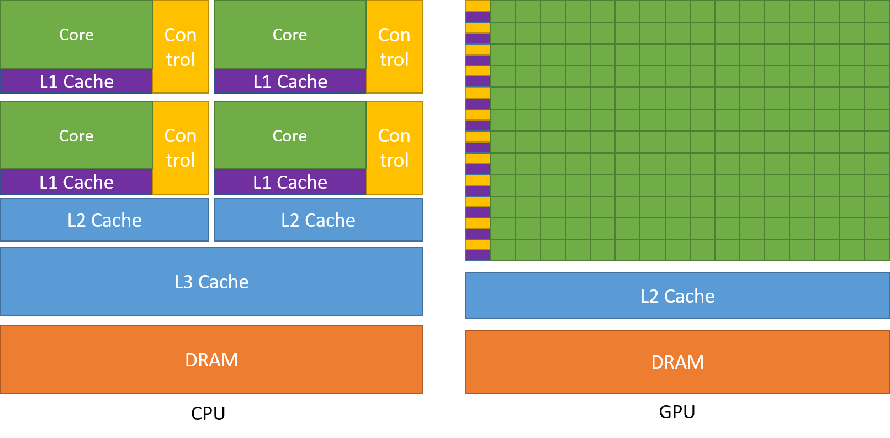

# 1.1 引言

## 1.1.1 图形处理器

图形处理器（Graphics Processing Unit，GPU）最初是为 3D 图形而生的专用处理器，作为固定功能硬件来加速实时 3D 渲染中的并行操作。经过几代的发展，GPU 变得越来越可编程。到 2003 年，图形流水线中的某些阶段已经完全可编程，对 3D 场景或图像的每个元素并行运行自定义代码。

2006 年，NVIDIA 推出了统一计算设备架构（Compute Unified Device Architecture，CUDA），使任何计算负载都能独立于图形 API 地利用 GPU 的吞吐能力。

从那时起，CUDA 和 GPU 计算被用于加速几乎所有类型的计算负载，从流体动力学或能量传输等科学模拟，到数据库与分析等商业应用。此外，GPU 的能力与可编程性也成为一系列新算法与新技术进步的基石，范围从图像分类一直到生成式人工智能，例如扩散模型或大语言模型。

## 1.1.2 使用 GPU 的好处

在相近的价格和功耗范围内，GPU 提供远高于 CPU 的指令吞吐和内存带宽。许多应用利用这些能力在 GPU 上比在 CPU 上运行得显著更快（参见 GPU Applications）。其它计算设备，如 FPGA，同样十分节能，但提供的可编程灵活性远不及 GPU。

GPU 与 CPU 在设计目标上有所不同。CPU 的设计目标是尽可能快地执行一串串行的操作（称为线程），并能并行执行数十条这样的线程；而 GPU 的设计目标则是擅长并行地执行数千条线程，以牺牲较低的单线程性能换取大得多的总吞吐。

GPU 专门面向高度并行的计算，把更多晶体管投入到数据处理单元，而 CPU 则把更多晶体管用于数据缓存和流程控制。图 1 给出了一个 CPU 与 GPU 芯片资源分布的示例。

> 图 1 GPU 把更多晶体管用于数据处理。原图取自 NVIDIA 官方指南，相对路径 `images/figure1-cpu-vs-gpu-transistors.png`——请把图片放到本附录的 `images/` 下使用此文件名，或把此引用替换为官方页面直链。

## 1.1.3 快速上手

利用 GPU 提供的算力有多种途径。本指南覆盖用 C++ 等高级语言为 CUDA GPU 平台编程的方式；但那些不需要直接编写 GPU 代码的应用，也有许多利用 GPU 的方式。

通过专门的库，可以获得从各个领域不断增长的算法和例程集合。当一个库已经实现——尤其是 NVIDIA 提供的库——使用它通常比从零开始重新实现算法更高效且性能更好。cuBLAS、cuFFT、cuDNN 和 CUTLASS 只是其中几个帮助开发者避免重新实现成熟算法的库的例子。这些库还有一项额外的好处：它们针对每种 GPU 架构进行了优化，在生产力、性能和可移植性之间提供了理想的平衡。

此外还有框架，尤其是用于人工智能的框架，提供经 GPU 加速的构建块。这些框架中有许多是通过利用上述经 GPU 加速的库来实现加速的。

此外，领域特定语言（DSL），例如 NVIDIA 的 Warp 或 OpenAI 的 Triton，会编译后直接在 CUDA 平台上运行。相比本指南所覆盖的高级语言，这提供了一种层次更高的 GPU 编程方式。

NVIDIA 加速计算中心（NVIDIA Accelerated Computing Hub）提供了关于 GPU 与 CUDA 计算的资源、示例与教程。

---

[← 返回附录 C 首页](README.md) ｜ [下一章 1.2 编程模型 →](02_programming_model.md)