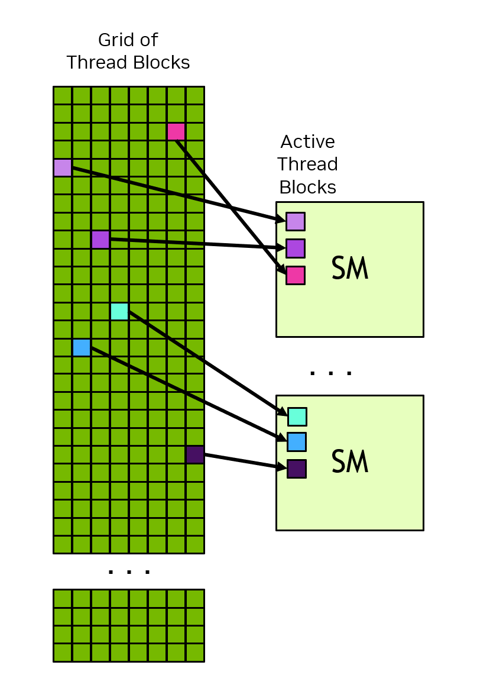
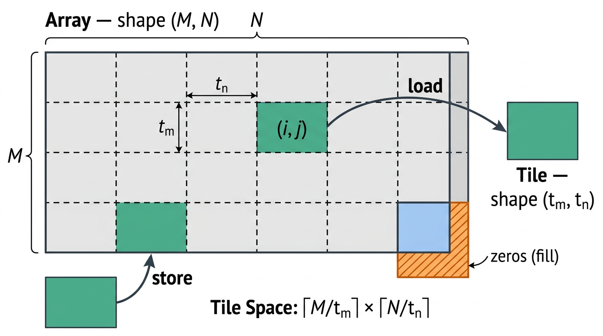

# 1.2 编程模型

本章在高层次上、与任何具体语言相分离地介绍 CUDA 编程模型。此处引入的术语和概念适用于任何受支持的编程语言中的 CUDA。后续章节会用 C++ 来图示这些概念。

## 1.2.1 异构系统

CUDA 编程模型假设一个异构计算系统，即一个同时包含 GPU 和 CPU 的系统。CPU 及其直连内存分别称为**主机（host）**和**主机内存（host memory）**。GPU 及其直连内存分别称为**设备（device）**和**设备内存（device memory）**。在某些片上系统（SoC）中，它们可能位于同一封装内。在更大的系统中，可能有多个 CPU 或多个 GPU。

CUDA 应用把一部分代码放到 GPU 上执行，但应用总是从 CPU 开始执行。在 CPU 上运行的主机代码可以使用 CUDA API 在主机内存和设备内存之间复制数据、启动 GPU 上的代码、并等待数据复制或 GPU 代码完成。CPU 和 GPU 可以同时执行代码，而通常通过最大化 CPU 和 GPU 双方的利用率来获得最佳性能。

应用在 GPU 上执行的代码称为**设备代码（device code）**，而被调用到 GPU 上执行的函数出于历史原因被称为 **kernel**。启动一个 kernel 运行这一动作称为**发射（launch）**。一次 kernel 发射可被看作启动许多线程在 GPU 上并行执行 kernel 代码。GPU 线程与 CPU 上的线程行为类似，但对正确性和性能都至关重要的一些差异将在后续章节中讲解（见 3.2.2.1.1 节）。

## 1.2.2 GPU 硬件模型

如同任何编程模型，CUDA 依赖于底层硬件的概念模型。就 CUDA 编程而言，GPU 可被视为一组**流多处理器（Streaming Multiprocessor，SM）**，它们被组织成称为**图形处理集群（Graphics Processing Cluster，GPC）**的组。每个 SM 包含一个本地寄存器堆、一个统一数据缓存，以及若干执行计算的功能单元。统一数据缓存为共享内存和 L1 缓存提供物理资源。统一数据缓存中如何分配给 L1 和共享内存可在运行时配置。不同类型内存的大小以及 SM 内功能单元的数量在不同 GPU 架构间可能不同。

> **注意**
>
> GPU 的实际硬件布局，或它物理上如何执行编程模型，可能有所不同。这些差异不影响使用 CUDA 编程模型编写的软件的正确性。

> 图 2 一个 GPU 拥有许多流多处理器（SM），每个 SM 包含许多功能单元。图形处理集群（GPC）是 SM 的集合。GPU 是若干由 GPC 连到 GPU 内存组成。CPU 通常有若干核心和一个连接到系统内存的内存控制器。CPU 与 GPU 之间通过 PCIe 或 NVLink 这样的互连连接。

### 1.2.2.1 线程块与网格

应用用一个 kernel 启动很多线程，通常是数百万线程。这些线程被组织成块。一个线程块被称为**线程块（thread block）**。线程块被组织成**网格（grid）**。一个网格中的所有线程块具有相同的大小和维度。图 3 是一个线程块网格的示意。

> 图 3 线程块网格。每个箭头代表一个线程（箭头数量不代表实际线程数）。

线程块和网格可以是一维、二维或三维的。这些维度可以简化把单个线程映射到工作单元或数据项的过程。

发射一个 kernel 时，用一个具体的**执行配置（execution configuration）**来指定 grid 和 thread block 的维度。执行配置还可包括可选参数，例如集群大小、stream 和 SM 配置等，这些会在后续章节介绍。

利用内建变量，执行 kernel 的每个线程可以确定它在自己所在块内的位置，以及它的块在所在网格内的位置。一个线程还可以用这些内建变量确定 kernel 所发射的 thread block 和 grid 的维度。这给了每个线程在所有运行该 kernel 的线程中一个唯一身份。这个身份常被用来确定一个线程负责哪些数据或操作。

一个线程块的所有线程都在单个 SM 上执行。这使一个线程块内的线程能够高效地相互通信和同步。同一线程块内的所有线程都能访问片上共享内存，共享内存可用来在线程块的线程之间交换信息。

一个 grid 可以由数百万个线程块组成，而运行这个 grid 的 GPU 可能只有几十或几百个 SM。一个线程块的所有线程由单个 SM 执行，并在大多数情况下[^1] 在该 SM 上运行到完成。线程块之间没有调度保证，因此一个线程块不能依赖其它线程块的结果，因为那些线程块在该线程块完成之前可能无法被调度。图 4 是 grid 中的线程块如何被分配到 SM 的示例。

> 图 4 每个 SM 有一个或多个活跃线程块。本例中每个 SM 上同时调度了 3 个线程块。grid 中线程块分配到 SM 的顺序没有保证。

CUDA 编程模型使任意大小的 grid 都能运行在任意大小的 GPU 上，无论该 GPU 只有一个 SM 还是有数千个 SM。为做到这一点，CUDA 编程模型在少数例外之外要求：**不同线程块中的线程之间不能有数据依赖**。也就是说，一个线程不应依赖另一个不同线程块的结果，也不应与同一 grid 中另一线程块里的线程同步。同一线程块中的所有线程在同一 SM 上同一时间运行。Grid 内不同的线程块在可用 SM 间调度，并且可以以任意顺序执行。简而言之，CUDA 编程模型要求线程块必须可以以任意顺序执行——并行地或串行地。

#### 1.2.2.1.1 线程块集群

除了线程块之外，计算能力 9.0 及以上的 GPU 还有一层可选的分组，称为**集群（cluster）**。集群是一组线程块，与线程块和 grid 一样，可以按一维、二维或三维排布。图 5 示意了一个也被组织成集群的线程块 grid。指定集群不改变 grid 维度，也不改变一个线程块在 grid 内的索引。

> 图 5 指定 cluster 时，线程块在 grid 中的位置不变，但在所处集群内额外有一个位置。

指定集群会把相邻的线程块分成集群，并在集群层级提供一些额外的同步与通信机会。具体来说，一个集群中的所有线程块都在单个 GPC 内执行。图 6 显示指定集群时线程块如何被调度到 GPC 内的 SM 上。由于线程块被同时调度且位于单个 GPC 内，同一集群但不同线程块中的线程可以使用 Cooperative Groups 提供的软件接口相互通信和同步。集群中的线程可以访问集群中所有块的共享内存，这被称为**分布式共享内存（distributed shared memory）**。集群的最大大小依赖硬件，并随设备而异。

图 6 示意了一个集群内的线程块如何在 GPC 内的 SM 上同时被调度。同一集群内的线程块在 grid 中彼此相邻。

> 图 6 指定 cluster 时，集群内的线程块以集群形状在 grid 中排列。一个集群的线程块被同时调度到单个 GPC 的 SM 上。

### 1.2.2.2 Warp 与 SIMT

在线程块内，线程被组织成 32 个线程一组的**warp**。warp 以**单指令多线程（Single-Instruction Multiple-Threads，SIMT）**范式执行 kernel 代码。在 SIMT 中，warp 中的所有线程都在执行同一份 kernel 代码，但每个线程可以走代码中不同的分支。也就是说，虽然程序的所有线程执行同一段代码，线程并不需要走同一条执行路径。

线程由 warp 执行时，被分配一个 **warp lane（warp 通道）**。warp lane 编号从 0 到 31，线程块中的线程按"硬件多线程"中说明的可预测方式分配到 warp。

warp 中的所有线程同时执行同一指令。如果 warp 中一些线程走了控制流分支而另一些没有，那么不走该分支的线程会被屏蔽，而走该分支的线程被执行。例如，如果某条件只对 warp 中一半线程为真，那么当活跃线程执行那些指令时，另一半 warp 会被屏蔽。图 7 示意了这种情况。当 warp 中不同线程走不同代码路径时，这有时被称为 **warp 发散（warp divergence）**。由此可得，当 warp 内线程走同一控制流路径时，GPU 利用率最高。

> 图 7 此例中只有偶数线程索引的线程执行 if 语句体，其余线程在执行体期间被屏蔽。

在 SIMT 模型中，warp 中所有线程以锁步方式在 kernel 中推进。硬件执行可能不同。关于这一区别在哪些场合重要，见"独立线程执行"有关章节。不建议利用 warp 执行实际如何映射到真实硬件的知识。CUDA 编程模型和 SIMT 说 warp 中的所有线程一起在代码中推进。只要遵循编程模型，硬件可以以对程序透明的方式优化被屏蔽的 lane。如果程序违反这一模型，可能导致未定义行为，且在不同 GPU 硬件上行为可能不同。

写 CUDA 代码时不必考虑 warp，但理解 warp 执行模型对理解全局内存合并访问和共享内存 bank 访问模式等概念有帮助。一些进阶编程技术利用线程块内 warp 的特化来限制线程发散并最大化利用率。本优化和其它优化都利用了"线程在执行时被分组为 warp"这一知识。

warp 执行的一个推论是：线程块的总线程数最佳为 32 的倍数。使用任意线程数都是合法的，但当总数不是 32 的倍数时，线程块的最后一个 warp 会有一些 lane 在整个执行中都闲置。这很可能导致该 warp 的功能单元利用率和内存访问都不佳。

SIMT 常被拿来与单指令多数据（SIMD）并行做比较，但有一些重要差异。SIMD 中执行只走单一控制流路径，而 SIMT 中每个线程可以走自己的控制流路径。因此 SIMT 不像 SIMD 一样有固定数据宽度。对 SIMT 更详细的讨论见"SIMT 执行模型"一节。

### 1.2.2.3 CUDA 中的 Tile 编程

除前面几节描述的 SIMT 模型外，CUDA 支持 **tile 编程模型**。在 tile 编程中，程序员在整线程块层次写代码，描述对称为 **tile** 的多维数据集合的操作。编译器把这些操作映射到块内的各个线程。

tile kernel 在 block 组成的 grid 上发射，与"线程块与网格"一节中的描述一致。每个 block 执行 tile kernel，并可以查询自己在 grid 中的位置以确定自己负责哪部分数据。程序员只指定 grid 维度；每 block 的线程数由编译器根据 kernel 中的 tile 操作决定（图 8）。

> 图 8 SIMT 与 tile 编程模型下程序员的视角。SIMT 中程序员按线程写代码并控制每个线程如何访问数据。tile 编程中程序员按 block 写作用于 tile 的代码；编译器把操作映射到 block 的线程。

在 tile kernel 内，block 执行单一控制流。程序员指定对 tile 的操作，编译器把工作分配到 block 的各线程。条件分支、循环等标准控制流结构都被支持，但由于 block 走单一控制流，因此没有 warp 发散的概念。**标量操作**，例如计算索引或循环边界，由 block 的单个线程执行。**tile 操作**，例如两个 tile 逐元素相加，由 block 的全部线程并行协同执行。

要注意不要把 **block（执行单元）** 和 **tile（数据单元）** 混为一谈。单个 block 可以创建并操作许多不同形状和数据类型的 tile。

#### 1.2.2.3.1 数组与 tile

tile kernel 处理两类数据：数组与 tile。**数组**（或全局数组）是存放在设备内存中的多维元素容器。数组是可变的：其内容可被 kernel 内的 store 操作修改。数组有形状和数据类型。

**tile** 是只在 tile 代码内存在、局部于单个 block 的多维值集合。tile 是不可变的：对 tile 的每一次操作都产生一个新 tile，而非修改既有 tile。与数组不同，tile 在内存中不一定有表示——编译器决定 tile 数据如何存放，可能使用寄存器、共享内存或 SM 的其它资源。tile 的每一维必须是 2 的幂，并且必须在编译期已知（即其值必须在 kernel 执行前可确定，而不是在执行中计算）。tile 不能作为 kernel 参数传递；它们完全在 tile 代码内被创建和消费。

#### 1.2.2.3.2 tile 空间与数据搬运

数据通过 load 和 store 操作在数组与 tile 之间流动。这些操作使用一个称为 **tile 空间**的概念，即把数组概念性地划分为等大、不重叠的 tile。例如考虑形状为 (M, N) 的二维数组。若 load 操作指定 tile 形状 (tm, tn)，数组在概念上被划分为若干 tile 行与若干 tile 列。在此 tile 空间中的索引，如 (i, j)，标识要加载哪个 tile。load 返回一个形状为 (tm, tn) 的 tile，含数组中对应元素。当 tile 超出数组边界时——例如在数组维度不是 tile 维度整数倍的边缘——load 会指明如何处理越界元素，例如用零填充（图 9）。

> 图 9 tile 空间与数据搬运。形状 (M, N) 的二维数组在概念上被划分为形状 (tm, tn) 的 tile 网格。在 tile 空间索引 (i, j) 处的一次 load 返回对应 tile。在数组边界，落在数组之外的元素可用零填充。store 在给定 tile 空间索引处把 tile 写回数组。

store 操作执行相反过程：给定一个 tile 和 tile 空间中的一个索引，把该 tile 的元素写到数组对应区域。任何落在数组边界之外的写都被静默丢弃。tile 程序还支持 gather 和 scatter 操作，它们在数组任意位置进行加载或存储。

#### 1.2.2.3.3 对 tile 的操作

tile 程序提供一组作用于 tile 的内建操作，包括逐元素算术、矩阵乘、沿一个或多个轴的归约（如求和与求最大值）、形状操作（如 reshape 和 transpose），以及类型转换。当两个不同形状的 tile 在一次操作中被组合时，较小的 tile 会在应用操作前自动扩展以匹配较大的 tile。

#### 1.2.2.3.4 与 SIMT 编程的关系

tile 编程与 SIMT 编程在 CUDA 中共存。一个应用可同时包含 SIMT 和 tile kernel，两类 kernel 都可对设备内存中同一份数据操作。编程模型的选择是按 kernel 决定的。tile 编程并不取代 SIMT 编程。SIMT 对单个线程提供细粒度控制，这对某些算法和优化技术仍然必要。tile 编程提供更高层的抽象，可以简化 kernel 开发。由于线程层次的决定权交给编译器，同一个 tile kernel 可以无需修改源码就在不同 GPU 架构上运行。两个模型都建立在前面几节描述的同一底层硬件——SM、线程块和 grid——之上。两个模型也都使用同一组设备内存空间，下一节介绍这些空间。

## 1.2.3 GPU 内存

在现代计算系统中，高效利用内存与最大化执行计算的功能单元的利用同等重要。异构系统有多个内存空间，GPU 除了缓存外还含有多种可编程的片上内存。下面几节更详细地介绍这些内存空间。

### 1.2.3.1 异构系统中的 DRAM 内存

GPU 和 CPU 都有直接相连的 DRAM 芯片。在有多个 GPU 的系统中，每个 GPU 有自己的内存。从设备代码视角看，连到 GPU 的 DRAM 被称为**全局内存（global memory）**，因为它对 GPU 内所有 SM 都可访问。这一术语并不表示它在系统内处处可访问。连到 CPU 的 DRAM 被称为**系统内存**或**主机内存**。

如同 CPU，GPU 使用虚拟内存寻址。在当前所有受支持的系统上，CPU 与 GPU 使用单一统一虚拟内存空间。这意味着系统中每个 GPU 的虚拟内存地址范围都是唯一的，且与 CPU 及系统中其它每个 GPU 不同。给定一个虚拟内存地址，可以判断它在 GPU 内存还是系统内存，并且在多 GPU 系统上可以判断在哪个 GPU 内存里。

有 CUDA API 可以分配 GPU 内存、CPU 内存，并在 CPU 与 GPU 之间、GPU 内部、或多 GPU 系统中不同 GPU 之间复制。需要时可以显式控制数据的位置。下面讨论的统一内存可让内存的放置由 CUDA 运行时或系统硬件自动处理。

### 1.2.3.2 GPU 中的片上内存

除全局内存外，每个 GPU 还有一些片上内存。每个 SM 有自己的寄存器堆和共享内存。这些内存是 SM 的一部分，并被 SM 内执行的线程极速访问。

寄存器堆存放线程局部变量，通常由编译器分配。共享内存可被线程块或集群内所有线程访问。共享内存可用于线程块或集群内线程之间交换数据。

SM 中的寄存器堆和统一数据缓存大小有限。SM 寄存器堆大小、统一数据缓存大小，以及统一数据缓存如何配置 L1 与共享内存平衡，可在"按计算能力的内存信息"一节查到。寄存器堆、共享内存空间和 L1 缓存在一个线程块的所有线程之间共享。

要把一个线程块调度到一个 SM，每个线程所需寄存器数乘线程块中的线程数，必须小于等于该 SM 中可用的寄存器数。如果一个线程块需要的寄存器数超过寄存器堆大小，kernel 无法发射，必须减少线程块中的线程数才能让线程块可发射。

共享内存的分配在 thread-block 层级进行。也就是说，与每个线程的寄存器分配不同，共享内存的分配对整个线程块统一。

#### 1.2.3.2.1 缓存

除可编程内存外，GPU 同时有 L1 与 L2 缓存。每个 SM 有一个 L1 缓存，它是统一数据缓存的一部分。一个更大的 L2 缓存被一个 GPU 内所有 SM 共享。这可在图 2 的 GPU 框图中看到。每个 SM 还有一个独立的**常量缓存**，用于缓存全局内存中被声明为在 kernel 生命期内为常量的值。编译器也可能把 kernel 参数放进常量内存。这能改善 kernel 性能——通过让 kernel 参数在 SM 内独立于 L1 数据缓存被缓存。

### 1.2.3.3 统一内存

当应用在 GPU 或 CPU 上显式分配内存时，该内存只能被该设备上运行的代码访问。也就是说，CPU 内存只能由 CPU 代码访问；GPU 内存只能由 GPU 上运行的 kernel 访问[^2]。CUDA 在 CPU 与 GPU 之间复制内存的 API 用于在恰当时刻把数据显式复制到正确的内存。

一个名为**统一内存（Unified Memory）**的 CUDA 特性允许应用做可同时被 CPU 或 GPU 访问的内存分配。CUDA 运行时或底层硬件会在需要时启用访问或把数据迁移到正确位置。即便使用统一内存，最佳性能依旧通过把内存迁移降到最少、并尽可能从直接连接到内存所在位置的处理器访问数据来获得。

系统的硬件特性决定内存空间之间访问和交换数据如何实现。"统一内存"一节介绍不同类别的统一内存系统。"统一内存"一节包含统一内存使用与行为在所有情形下的更多细节。

[^1]: 在使用 CUDA 动态并行等特性的某些情形中，一个线程块可能被挂起到内存。这意味着 SM 的状态被存到一块由系统管理的 GPU 内存区域，SM 被释放去执行其它线程块。这类似于 CPU 上的上下文切换。这并不常见。

[^2]: 此规则的一个例外是**映射内存（mapped memory）**——它是一种 CPU 内存，但用使其能直接从 GPU 访问的属性来分配。然而，映射访问通过 PCIe 或 NVLink 连接进行。GPU 无法用并行性掩盖更高的延迟和更低的带宽，因此映射内存不能作为统一内存或把数据放进合适内存空间的高性能替代。

---

[← 上一章 1.1 引言](01_intro.md) ｜ [返回附录 C 首页](README.md) ｜ [下一章 1.3 CUDA 平台 →](03_platform.md)