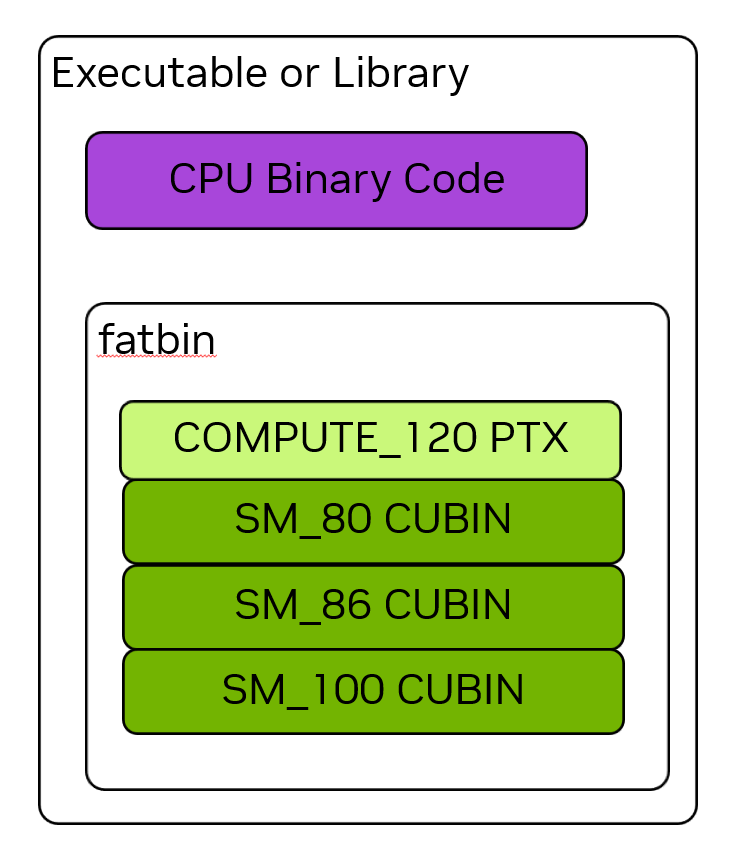

# 1.3 CUDA 平台

NVIDIA CUDA 平台由许多软件和硬件部件、以及为在异构系统上计算而开发的许多重要技术组成。本章介绍 CUDA 平台中一些应用开发者需要理解的基本概念和组件。与"编程模型"一样，本章不针对任何一种编程语言，而适用于所有使用 CUDA 平台的场合。

## 1.3.1 计算能力与流多处理器版本

每个 NVIDIA GPU 都有一个**计算能力（Compute Capability，CC）**编号，用来指示该 GPU 支持哪些特性并给出该 GPU 的若干硬件参数。这些规格记录在第 5.1 节附录中。所有 NVIDIA GPU 及其计算能力的清单见 CUDA GPU Compute Capability 页面。

计算能力以主版本号与次版本号的 X.Y 形式表示，其中 X 为主版本号、Y 为次版本号。例如 CC 12.0 主版本为 12、次版本为 0。计算能力直接对应 SM 的版本号。例如 CC 12.0 的 GPU 内的 SM 版本为 sm_120。此版本用于给二进制打标签。

第 5.1.1 节介绍如何查询并确定系统中 GPU 的计算能力。

## 1.3.2 CUDA Toolkit 与 NVIDIA 驱动

NVIDIA 驱动可被看作 GPU 的操作系统。它是一份必须安装到主机系统操作系统上的软件组件，对一切 GPU 用途（包括显示与图形功能）都必不可少。NVIDIA 驱动是 CUDA 平台的基础。除 CUDA 外，NVIDIA 驱动还提供使用 GPU 的其它一切方式，例如 Vulkan 和 Direct3D。NVIDIA 驱动有 r580 这样的版本号。

CUDA Toolkit 是一组用于编写、构建和分析利用 GPU 计算的软件的库、头文件与工具。CUDA Toolkit 与 NVIDIA 驱动是相互独立的软件产品。

**CUDA 运行时**是 CUDA Toolkit 所提供库中的一种特殊情况。CUDA 运行时既提供 API，也提供一些语言扩展，用以处理分配内存、在 GPU 与其它 GPU 或 CPU 间复制数据、发射 kernel 等常见任务。CUDA 运行时的 API 部分被称为**CUDA 运行时 API（CUDA runtime API）**。

CUDA Compatibility 文档给出不同 GPU、NVIDIA 驱动与 CUDA Toolkit 版本之间兼容性的完整细节。

### 1.3.2.1 CUDA 运行时 API 与 CUDA 驱动 API

CUDA 运行时 API 构建于一个更底层的 API——**CUDA 驱动 API（CUDA driver API）**之上，后者由 NVIDIA 驱动暴露。本指南以 CUDA 运行时 API 暴露的 API 为主。若愿意，只用驱动 API 也能实现全部相同功能。有一些功能只能通过驱动 API 使用。应用可只使用其中一种 API，也可两者互操作地混用。"CUDA 驱动 API"一节介绍运行时 API 与驱动 API 之间的互操作。

CUDA 运行时 API 函数的完整参考见 CUDA Runtime API Documentation。

CUDA 驱动 API 的完整参考见 CUDA Driver API Documentation。

## 1.3.3 并行线程执行（PTX）

CUDA 平台一个基础但有时不可见的层是**并行线程执行（Parallel Thread Execution，PTX）**虚拟指令集架构（ISA）。PTX 是面向 NVIDIA GPU 的高级汇编语言。PTX 在真实 GPU 硬件的物理 ISA 之上提供一层抽象。与其它平台一样，应用可直接用这种汇编语言编写，但这样做会给软件开发增加不必要的复杂性与难度。

领域特定语言与高级语言编译器可以把 PTX 代码作为中间表示（IR）生成，再用 NVIDIA 的离线或即时（JIT）编译工具产出可执行的 GPU 二进制代码。这使 CUDA 平台除 NVCC（NVIDIA CUDA 编译器）等 NVIDIA 提供的工具支持的语言外，还能被其它语言编程。

由于 GPU 能力随时间演进，PTX 虚拟 ISA 规范有版本号。PTX 版本与 SM 版本一样，对应一个计算能力。例如，支持计算能力 8.0 全部特性的 PTX 称为 compute_80。

PTX 的完整文档见 PTX ISA。

## 1.3.4 Cubin 与 Fatbin

CUDA 应用与库通常用 C++ 等高级语言编写。高级语言被编译为 PTX，PTX 再被编译为真实物理 GPU 的二进制——称为 **CUDA 二进制**，简称 **cubin**。cubin 针对特定 SM 版本有特定的二进制格式，例如 sm_120。

使用 GPU 计算的可执行文件和库二进制同时含 CPU 和 GPU 代码。GPU 代码存放在一个称为 **fatbin** 的容器内。fatbin 可含针对多个不同目标的 cubin 与 PTX。例如一个应用可带有为多个不同 GPU 架构（即不同 SM 版本）构建的二进制。运行应用时，其 GPU 代码被加载到具体 GPU 上，并使用 fatbin 中最适合该 GPU 的二进制。

> 图 10 可执行或库的二进制既含 CPU 二进制代码，也含一个用于 GPU 代码的 fatbin 容器。fatbin 可同时含 cubin GPU 二进制代码和 PTX 虚拟 ISA 代码。PTX 代码可为未来目标做 JIT 编译。

fatbin 也可含一份或多份 PTX 形式的 GPU 代码，其用途见 PTX 兼容性一节。图 10 示意了一个含有多版本 cubin GPU 代码以及一份 PTX 代码的应用或库二进制。

### 1.3.4.1 二进制兼容性

NVIDIA GPU 在某些情况下保证二进制兼容性。具体而言，在计算能力主版本内，计算能力次版本大于或等于 cubin 所目标版本号的 GPU 可以加载并执行该 cubin。例如，应用若含为计算能力 8.6 编译的 cubin，则该 cubin 可在计算能力 8.6 或 8.9 的 GPU 上加载执行；但不能在计算能力 8.0 的 GPU 上加载，因为该 GPU 次版本 0 低于代码次版本 6。

NVIDIA GPU 在不同主版本计算能力之间**不**二进制兼容。也就是说，为计算能力 8.6 编译的 cubin 代码无法在计算能力 9.0 的 GPU 上加载。

讨论二进制代码时，常称该代码有 sm_86 这样的版本（如上例）。这等同于说该二进制是为计算能力 8.6 构建。这种简写很常用，因为它是开发者向 NVIDIA CUDA 编译器 nvcc 指定二进制构建目标的方式。

> **注意**
>
> 二进制兼容性仅对由 nvcc 等 NVIDIA 工具创建的二进制有效。不支持对 NVIDIA GPU 的二进制代码手工编辑或生成。若对二进制做任何修改，兼容性保证即失效。

### 1.3.4.2 PTX 兼容性

GPU 代码可以二进制或 PTX 形式存放在可执行文件中（见 Cubin 与 Fatbin 一节）。当应用存放 PTX 形式的 GPU 代码时，该 PTX 可在应用运行时被 JIT 编译为任意计算能力不低于该 PTX 代码所对应计算能力的版本。例如，若应用含 compute_80 的 PTX，应用运行时该 PTX 代码可被 JIT 编译为后续的 SM 版本，如 sm_120。这提供了与未来 GPU 的前向兼容，而无需重建应用或库。

### 1.3.4.3 即时编译

应用在运行时加载的 PTX 代码由设备驱动编译为二进制代码，称为**即时（just-in-time，JIT）编译**。即时编译会增加应用加载时间，但能让应用受益于随新设备驱动带来的每一次编译器改进，并使应用能运行在编译时尚不存在的设备上。

设备驱动为应用即时编译 PTX 代码时，会自动缓存一份生成的二进制代码副本，以避免在该应用后续启动时重复编译。该缓存称为 **compute cache**，在设备驱动升级时自动失效，使应用能受益于内置于新设备驱动的新即时编译器中的改进。

自最早版本 CUDA 起，运行时如何以及何时对 PTX 进行 JIT 编译不断放宽，提供了更多何时、是否对部分或全部 kernel 做 JIT 编译的灵活性。"Lazy Loading"一节介绍可用选项与如何控制 JIT 行为。还有少数环境变量控制即时编译行为，见 CUDA Environment Variables。

作为使用 nvcc 编译 CUDA C++ 设备代码的替代，可用 NVRTC 在运行时把 CUDA C++ 设备代码编译为 PTX。NVRTC 是面向 CUDA C++ 的运行时编译库；更多信息见 NVRTC User Guide。

---

[← 上一章 1.2 编程模型](02_programming_model.md) ｜ [返回附录 C 首页](README.md)