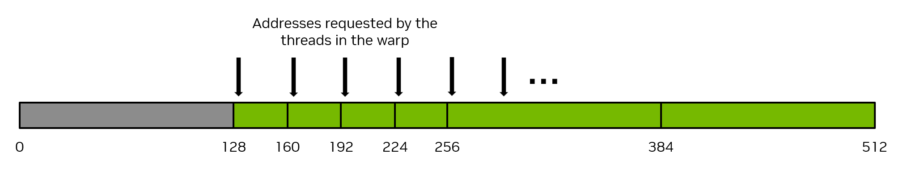
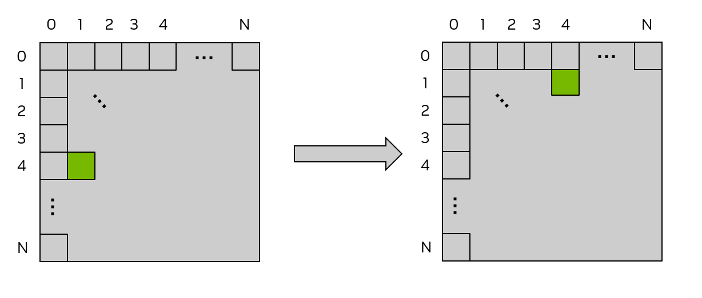
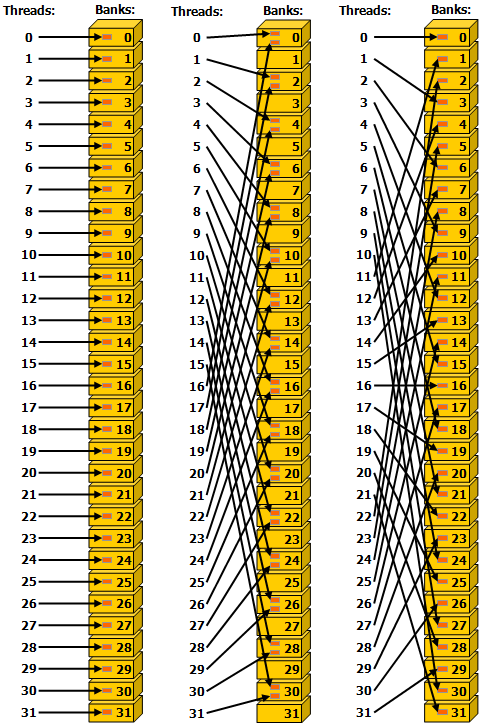
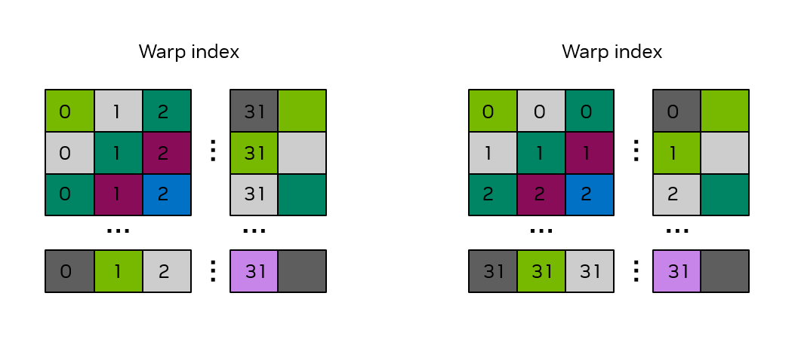

# 2.3 编写 SIMT Kernel

CUDA kernel 在很大程度上可以按传统 CPU 代码针对给定问题的方式来编写。但 GPU 有一些可用于提升性能的独特特性。此外，理解 GPU 上线程如何被调度、如何访问内存、执行如何推进，可以帮助开发者写出最大化可用计算资源利用率的 kernel。

本章讲解用 SIMT 编程模型在 C++ 和 Python 中编写 kernel 的更多细节。

## 2.3.1 SIMT 基础

从开发者视角看，CUDA 线程是并行的基本单位。1.2.2.2 节描述了 GPU 执行的基本 SIMT 模型，"SIMT 执行模型"提供 SIMT 模型的更多细节。SIMT 模型允许每个线程维护自己的状态和控制流。从功能角度看，每个线程可以走一条独立的代码路径。然而，通过小心编写 kernel 代码以尽量减少同一 warp 中线程走发散代码路径的情况，可以实现可观的性能提升。

## 2.3.2 线程层级

线程被组织成线程块，线程块再组织成 grid。grid 可以是一维、二维或三维的，其大小可以在 kernel 内用 `gridDim` 内建变量查询。线程块也可以是一维、二维或三维的。线程块的大小可以在 kernel 内用 `blockDim` 内建变量查询。线程块的索引用 `blockIdx` 内建变量查询。在线程块内，线程的索引用 `threadIdx` 内建变量获取。这些内建变量用于为每个线程计算一个唯一的全局线程索引，从而让每个线程能从全局内存装载/存储特定数据，并按需执行独有的代码路径。

**C++**

- `gridDim.[x|y|z]`：grid 在 x、y、z 维度上各自的大小。这些值对所有线程相同，是 kernel 发射时执行配置的一部分。
- `blockDim.[x|y|z]`：block 在 x、y、z 维度上各自的大小。这些值对所有线程相同，是 kernel 发射时执行配置的一部分。
- `blockIdx.[x|y|z]`：block 在 grid 的 x、y、z 维度上各自的索引。这些值在线程间不同，指示哪个线程块正在执行。
- `threadIdx.[x|y|z]`：线程在线程块的 x、y、z 维度上各自的索引。这些值在线程间不同，指示哪个线程正在执行。

**Python**

（Python 中对应 `cuda.gridDim`、`cuda.blockDim`、`cuda.blockIdx`、`cuda.threadIdx`，含义与上面 C++ 一致。）

使用多维线程块与 grid 只是为了方便，并不影响性能。一个 block 的线程按可预测方式线性化：第一索引 x 移动最快，其次是 y，再其次是 z。这意味着在线程索引的线性化中，`threadIdx.x` 的连续值表示连续线程，`threadIdx.y` 的步长为 `blockDim.x`，`threadIdx.z` 的步长为 `blockDim.x * blockDim.y`。这影响线程如何分配到 warp，详见"硬件多线程"。

图 11 展示了一个简单的 2D grid、1D 线程块的示例。


> 图 11 线程块网格。

### 2.3.2.1 线程块同步

前面示例中并不需要在线程块内同步线程。当线程块内线程协作或访问相同内存地址——尤其是在下面描述的共享内存中——时需要同步，以避免竞态条件和内存冒险。

block 内最基础的同步形式称为 syncthreads。

## 2.3.3 GPU 设备内存空间

CUDA 设备有几个内存空间，可被 kernel 内的 CUDA 线程访问。表 1 总结了常见内存类型、其线程作用域与生命期。下面几节逐一详解。

**表 1 内存类型、作用域与生命期**

| 内存类型 | 作用域 | 生命期 | 位置 |
|---|---|---|---|
| Global | Grid | 应用 | 设备 |
| Constant | Grid | 应用 | 设备 |
| Shared | Block | Kernel | SM |
| Local | Thread | Kernel | 设备 |
| Register | Thread | Kernel | SM |

### 2.3.3.1 全局内存

全局内存（也叫设备内存）是存放可被 kernel 内所有线程访问的数据的主要内存空间，类似 CPU 系统中的 RAM。GPU 上运行的 kernel 可以直接访问全局内存，正如 CPU 上运行的代码可以访问系统内存。

全局内存是持久的。即全局内存中的分配和其中存储的数据会一直存在，直到该分配被释放或应用终止。`cudaDeviceReset` 也会释放所有分配。

全局内存通过 `cudaMalloc`、`cudaMallocManaged` 等 CUDA API 调用分配。可以用 `cudaMemcpy` 等 CUDA 运行时 API 把数据从 CPU 内存复制进全局内存。用 CUDA API 做的全局内存分配用 `cudaFree` 释放。

在 kernel 发射之前，全局内存由 CUDA API 调用分配并初始化。kernel 执行期间，CUDA 线程可读取全局内存中的数据，CUDA 线程执行操作产生的结果可以写回全局内存。kernel 完成执行后，其写到全局内存的结果可以复制回主机或被 GPU 上其它 kernel 使用。

由于全局内存可被 grid 内所有线程访问，必须小心避免线程间的数据竞争。由于从主机发射的 CUDA kernel 返回类型为 `void`，kernel 计算出的数值结果要返回到主机，唯一方式就是把结果写到全局内存。

下面 kernel 是说明全局内存使用的简单示例，三个数组 A、B、C 在全局内存中，被该向量加 kernel 访问。

**C++**

```cpp
__global__ void vecAdd(float* A, float* B, float* C, int vectorLength)
{
    int workIndex = threadIdx.x + blockIdx.x*blockDim.x;
    if(workIndex < vectorLength)
    {
        C[workIndex] = A[workIndex] + B[workIndex];
    }
}
```

**Python**

（Python 中对应 `@cuda.jit` 装饰的 `vecadd`，逻辑同上，见 2.2 节示例。）

### 2.3.3.2 共享内存

共享内存是可被线程块内所有线程访问的内存空间。它物理上位于每个 SM 上，与 L1 缓存使用同一物理资源——统一数据缓存。共享内存中的数据在 kernel 执行期间持续存在。共享内存可被视为 kernel 执行期间用户管理的便签本。虽然相对全局内存其容量较小，但因为它位于每个 SM 上，带宽更高、延迟更低，访问比全局内存快。

由于共享内存可被线程块内所有线程访问，必须小心避免同一线程块内线程间的数据竞争。同一线程块内线程间同步可以在 C++ 中用 `__syncthreads()` 函数实现。Python 中用 `cuda.syncthreads()` 实现同样的线程块同步。该函数阻塞线程块内所有线程，直到所有线程都到达 `__syncthreads()` 或 `cuda.syncthreads()` 调用。

**C++**

```cpp
// assuming blockDim.x is 128
__global__ void example_syncthreads(int* input_data, int* output_data)
{
    __shared__ int shared_data[128];
    shared_data[threadIdx.x] = input_data[blockDim.x*blockIdx.x + threadIdx.x];

    // All threads synchronize, guaranteeing all writes to 'shared_data' are ordered
    // before any thread is unblocked from '__syncthreads()':
    __syncthreads();

    // A single thread safely reads 'shared_data':
    if (threadIdx.x == 0) {
        float sum = 0;
        for (int i = 0; i < blockDim.x; ++i) {
            sum += shared_data[i];
        }
        output_data[blockIdx.x] = sum;
    }
}
```

**Python**

（Python 中用 `cuda.shared.array(...)` 声明共享数组，用 `cuda.syncthreads()` 同步，逻辑同上。）

共享内存大小因所用 GPU 架构而异。由于共享内存和 L1 缓存共享同一物理空间，使用共享内存会减少 kernel 可用 L1 缓存的大小。此外，如果 kernel 不使用共享内存，整块物理空间会被 L1 缓存利用。CUDA 运行时 API 提供 `cudaGetDeviceProperties` 函数，可通过 `cudaDeviceProp.sharedMemPerMultiprocessor` 和 `cudaDeviceProp.sharedMemPerBlock` 设备属性按 SM 基础和按线程块基础查询共享内存大小。

CUDA 运行时 API 提供 `cudaFuncSetCacheConfig` 函数，告知运行时把更多空间分配给共享内存还是 L1 缓存。该函数向运行时指定偏好，但不保证被采纳。运行时可以根据可用资源和 kernel 需要自由决定。

共享内存可静态和动态分配。

#### 2.3.3.2.1 共享内存的静态分配

要静态分配共享内存，程序员在 kernel 内用 C++ 的 `__shared__` 说明符或 Python 的 `cuda.shared.array()` 声明一个变量。该数组会被分配在共享内存中，并在 kernel 执行期间持续存在。这样声明的共享内存大小必须在编译期指定。例如下面代码片段（在 kernel 体内）声明一个 1024 元素的 float 共享内存数组。

**C++**

```cpp
__shared__ float sharedArray[1024];
```

**Python**

（Python 中用 `cuda.shared.array(shape=1024, dtype=np.float32)` 声明。）

此声明之后，线程块内所有线程都可访问该共享内存数组。

#### 2.3.3.2.2 共享内存的动态分配

在 C++ 中要动态分配共享内存，程序员可以在三尖括号记法的 kernel 发射中以每线程块字节数指定为第三个（可选）参数，形如 `functionName<<<grid, block, sharedMemoryBytes>>>()`。未指定时默认为 0。

在 Python 中，必须用 `cuda.core.launch()` 发射 kernel。`LaunchConfig` 参数取一个 `cuda.core.LaunchConfig` 对象，该对象有一个 `shmem_size` 字段，作用与 C++ 三尖括号记法中的第三个参数相同。

在 kernel 内，程序员可以在 C++ 中用 `extern __shared__` 说明符加空的 `[]` 声明一个在 kernel 发射时动态分配的变量。Python 中，用与静态分配共享内存相同的 `cuda.shared.array` 方法，并把 shape 参数设为 0。

**C++**

```cpp
extern __shared__ float sharedArray[];
```

**Python**

（Python 中用 `cuda.shared.array(shape=0, dtype=...)` 声明。）

一个注意点是：一个 kernel 只能有一个动态分配的共享数组。若想要多个动态分配的共享内存数组，必须分配一个足够大的单一动态共享内存数组并手动分区。例如在 C++ 中，若想要下面这些等价物：

**C++**

```cpp
short array0[128];
float array1[64];
int   array2[256];
```

在动态分配的共享内存中，可以这样声明并初始化数组：

**C++**

```cpp
extern __shared__ float array[];

short* array0 = (short*)array;
float* array1 = (float*)&array0[128];
int*   array2 =   (int*)&array1[64];
```

注意指针必须按其所指类型对齐，所以下面代码不工作，因为 `array1` 未对齐到 4 字节。

**C++**

```cpp
extern __shared__ float array[];
short* array0 = (short*)array;
float* array1 = (float*)&array0[127];
```

Python 中由于没有指针，这种类型双关不可用。

### 2.3.3.3 寄存器

寄存器位于 SM 上，具有线程局部作用域。寄存器使用由编译器管理，寄存器用于 kernel 执行期间的线程局部存储。每 SM 的寄存器数和每线程块的寄存器数可通过 GPU 的 `regsPerMultiprocessor` 和 `regsPerBlock` 设备属性查询。

编译 C++ 代码时，NVCC 允许开发者通过 `-maxrregcount` 选项指定 kernel 使用的最大寄存器数。用该选项减少 kernel 可用寄存器数可能让更多线程块同时被调度到 SM 上，但也可能导致更多寄存器溢出。寄存器溢出指当前存在片上寄存器中的值必须写到全局内存、之后再读回来，以腾出空间给其它值。

### 2.3.3.4 局部内存

局部内存是与寄存器类似的线程局部存储，也由 NVCC 管理，但局部内存的物理位置在全局内存空间。"局部"这一标签指其逻辑作用域而非物理位置。局部内存用于 kernel 执行期间的线程局部存储。编译器可能放入局部内存的自动变量有：

- 无法确定其索引是常量的数组，
- 会消耗过多寄存器空间的大结构或大数组，
- 任何变量，当 kernel 使用寄存器数超过可用数时，即寄存器溢出。

由于局部内存空间位于设备内存，局部内存访问有与全局内存访问相同的延迟和带宽，并需满足"合并的全局内存访问"中所述的内存合并要求。但局部内存的组织使得连续 32 位字被连续线程 ID 访问。因此只要 warp 内所有线程访问同一相对地址——例如同一数组变量的同一索引或同一结构变量的同一成员——访问就是完全合并的。

### 2.3.3.5 常量内存

常量内存具有 grid 作用域，在应用生命期内可访问。常量内存位于设备上，对 kernel 是只读的。

C++ 中，变量或数组用 `__constant__` 说明符在任何 kernel 或函数之外声明。

Python 中，在 kernel 代码内用 `const_array = numba.cuda.const.array_like(ary)` 指定一个包含主机数组 `ary` 中数据的常量内存数组。

常量内存意味着一个变量：

- 位于常量内存空间，
- 每个设备有一个独立的对象，
- grid 内所有线程和在 C++ 中通过运行时库（`cudaGetSymbolAddress()` / `cudaGetSymbolSize()` / `cudaMemcpyToSymbol()` / `cudaMemcpyFromSymbol()`）从主机都可访问。

C++ 中，常量内存的生命期为其创建所在 context 的生命期。Python 中，常量内存的生命期为其声明所在 kernel 的生命期。

常量内存总量可通过 `totalConstMem` 设备属性元素查询。

常量内存适用于每个线程以只读方式使用的小量数据。常量内存相对其它内存很小，通常每设备 64KB。

下面是声明和使用常量内存的示例片段。

**C++**

```cpp
// In your .cu file
__constant__ float coeffs[4];

__global__ void compute(float *out) {
    int idx = threadIdx.x;
    out[idx] = coeffs[0] * idx + coeffs[1];
}

// In your host code
float h_coeffs[4] = {1.0f, 2.0f, 3.0f, 4.0f};
cudaMemcpyToSymbol(coeffs, h_coeffs, sizeof(h_coeffs));
compute<<<1, 10>>>(device_out);
```

**Python**

（Python 中用 `numba.cuda.const.array_like` 创建常量内存数组。）

### 2.3.3.6 缓存

GPU 设备有包括 L2 与 L1 缓存的多级缓存结构。

L2 缓存位于设备上，被所有 SM 共享。L2 缓存大小可通过 `cudaGetDeviceProperties` 函数的 `l2CacheSize` 设备属性元素查询。

如上面"共享内存"所述，L1 缓存物理上位于每个 SM 上，与共享内存使用同一物理空间。如果 kernel 不使用共享内存，整块物理空间会被 L1 缓存利用。

L2 与 L1 缓存可通过函数控制，允许开发者指定各种缓存行为。这些函数的细节见"配置 L1/共享内存平衡"、"L2 缓存控制"和"低层 Load/Store 函数"。

如果不用这些提示，编译器和运行时会尽力高效利用缓存。

### 2.3.3.7 纹理与表面内存

> **注意**
>
> 一些较老的 CUDA 代码可能使用纹理内存，因为在较老的 NVIDIA GPU 上某些场景这样做有性能收益。在所有当前受支持的 GPU 上，这些场景可用直接 load/store 指令处理，对非纹理 load 使用纹理和表面内存指令不再带来任何性能收益。

GPU 可能有专用指令从图像中加载数据用作 3D 渲染中的纹理。CUDA 通过纹理对象 API 和表面对象 API 暴露这些指令及使用它们的机制。

在所有当前受支持的 NVIDIA GPU 上，纹理与表面内存在 CUDA 中对非图形应用不提供任何性能优势。这些 API 在为渲染读取纹理或表面数据时仍是有用的，例如为 NVIDIA OptiX 编写 hit shader——OptiX 用 CUDA 作为其 shader 语言。

对于还在为非纹理 load 使用这些 API 的现有代码库，这些 API 的说明仍可在 legacy CUDA C++ Programming Guide 中找到。

### 2.3.3.8 分布式共享内存

> **注意**
>
> 分布式共享内存是使用线程块集群时才可用的特性。线程块集群使用 cooperative_groups API，目前只在 C++ 中可用。

线程块集群在计算能力 9.0 引入，由 Cooperative Groups 推动，使线程块集群中的线程可以访问该集群中所有参与线程块的共享内存。这种分区共享内存称为**分布式共享内存**，对应地址空间称为**分布式共享内存地址空间**。属于某线程块集群的线程可以在分布式地址空间中读、写或执行原子操作，无论地址属于本地线程块还是远端线程块。无论 kernel 是否使用分布式共享内存，共享内存大小的指定——静态或动态——仍按每线程块。分布式共享内存大小就是每集群线程块数乘以每线程块共享内存大小。

访问分布式共享内存中的数据要求所有线程块都存在。用户可以用 `cluster_group` 类的 `cluster.sync()` 来保证所有线程块都已开始执行。用户还需确保所有分布式共享内存操作都发生在某线程块退出之前——例如，若一个远端线程块要读某线程块的共享内存，程序需保证该远端线程块所读的共享内存读操作在该线程块退出之前已完成。

我们来看一个简单的直方图计算，以及如何在用线程块集群在 GPU 上优化它。计算直方图的一种标准做法是在每个线程块的共享内存中做计算，然后做全局内存原子操作。此法的一个限制是共享内存容量——一旦直方图 bin 不再装得下共享内存，用户就需要直接在全局内存中计算直方图，相应地做全局内存原子操作。有了分布式共享内存，CUDA 提供一个中间阶梯：依据直方图 bin 大小，可以在共享内存、分布式共享内存或直接在全局内存中计算直方图。

下面的 CUDA kernel 示例展示依据直方图 bin 数在共享内存或分布式共享内存中计算直方图。

**C++**

```cpp
#include <cooperative_groups.h>

// Distributed Shared memory histogram kernel
__global__ void clusterHist_kernel(int *bins, const int nbins, const int bins_per_block, const int *__restrict__ input,
                                    size_t array_size)
{
    extern __shared__ int smem[];
    namespace cg = cooperative_groups;
    int tid = cg::this_grid().thread_rank();

    // Cluster initialization, size and calculating local bin offsets.
    cg::cluster_group cluster = cg::this_cluster();
    unsigned int clusterBlockRank = cluster.block_rank();
    int cluster_size = cluster.dim_blocks().x;

    for (int i = threadIdx.x; i < bins_per_block; i += blockDim.x)
    {
        smem[i] = 0; //Initialize shared memory histogram to zeros
    }

    // cluster synchronization ensures that shared memory is initialized to zero in
    // all thread blocks in the cluster. It also ensures that all thread blocks
    // have started executing and they exist concurrently.
    cluster.sync();

    for (int i = tid; i < array_size; i += blockDim.x * gridDim.x)
    {
        int ldata = input[i];

        //Find the right histogram bin.
        int binid = ldata;
        if (ldata < 0)
            binid = 0;
        else if (ldata >= nbins)
            binid = nbins - 1;

        //Find destination block rank and offset for computing
        //distributed shared memory histogram
        int dst_block_rank = (int)(binid / bins_per_block);
        int dst_offset = binid % bins_per_block;

        //Pointer to target block shared memory
        int *dst_smem = cluster.map_shared_rank(smem, dst_block_rank);

        //Perform atomic update of the histogram bin
        atomicAdd(dst_smem + dst_offset, 1);
    }

    // cluster synchronization is required to ensure all distributed shared
    // memory operations are completed and no thread block exits while
    // other thread blocks are still accessing distributed shared memory
    cluster.sync();

    // Perform global memory histogram, using the local distributed memory histogram
    int *lbins = bins + cluster.block_rank() * bins_per_block;
    for (int i = threadIdx.x; i < bins_per_block; i += blockDim.x)
    {
        atomicAdd(&lbins[i], smem[i]);
    }
}
```

上面这个 kernel 可以在运行时根据所需的分布式共享内存量以不同集群大小发射。如果直方图小到能装进单个 block 的共享内存，用户可以用集群大小 1 发射。下面代码片段展示如何基于共享内存需要动态发射一个集群 kernel。

**C++**

```cpp
// Launch via extensible launch
{
    cudaLaunchConfig_t config = {0};
    config.gridDim = array_size / threads_per_block;
    config.blockDim = threads_per_block;

    // cluster_size depends on the histogram size.
    // ( cluster_size == 1 ) implies no distributed shared memory, just thread block local shared memory
    int cluster_size = 2; // size 2 is an example here
    int nbins_per_block = nbins / cluster_size;

    //dynamic shared memory size is per block.
    //Distributed shared memory size =  cluster_size * nbins_per_block * sizeof(int)
    config.dynamicSmemBytes = nbins_per_block * sizeof(int);

    CUDA_CHECK(::cudaFuncSetAttribute((void *)clusterHist_kernel, cudaFuncAttributeMaxDynamicSharedMemorySize, config.dynamicSmemBytes));

    cudaLaunchAttribute attribute[1];
    attribute[0].id = cudaLaunchAttributeClusterDimension;
    attribute[0].val.clusterDim.x = cluster_size;
    attribute[0].val.clusterDim.y = 1;
    attribute[0].val.clusterDim.z = 1;

    config.numAttrs = 1;
    config.attrs = attribute;

    cudaLaunchKernelEx(&config, clusterHist_kernel, bins, nbins, nbins_per_block, input, array_size);
}
```

## 2.3.4 内存性能

确保内存使用得当是在 CUDA kernel 中获得高性能的关键。本节讨论从 CUDA kernel 的全局内存和共享内存中获得高内存吞吐的一些通用原则与示例。对大多数 kernel 而言，全局内存性能是首要性能考量。共享内存常被用于线程操作未由它显式装载或创建的数据，因此理解共享内存的性能相关特性也很重要。

下面几个小节将通过逐步改进一个示例矩阵转置 kernel 中对全局内存和共享内存的访问，来说明内存访问的重要方面。

### 2.3.4.1 合并的全局内存访问

全局内存通过 32 字节内存事务访问。当一个 CUDA 线程从全局内存请求一个字的数据时，相关 warp 把该 warp 内所有线程的内存请求合并为满足请求所必需的若干内存事务——数量取决于每个线程访问的字大小以及内存地址在线程间的分布。例如，如果一个线程请求一个 4 字节的字，warp 向全局内存实际产生的内存事务总大小将是 32 字节。要最高效地使用内存系统，warp 应该用上单次内存事务中取回的所有内存。即如果一个线程请求 4 字节字、事务大小为 32 字节，如果该 warp 中其它线程能用上这次 32 字节请求中的其它 4 字节字，则这是对内存系统最高效的使用。

作为简单示例，如果 warp 内连续线程请求内存中连续的 4 字节字，那么 warp 总共会请求 128 字节内存，这 128 字节会通过 4 个 32 字节内存事务取回。这使内存事务被 warp 内线程 100% 利用。图 12 示意了这个完美合并内存访问的例子。


> 图 12 合并的内存访问。

反之，极端最坏情形是连续线程访问的元素在内存中彼此相距 32 字节或更远。此时 warp 被迫为每个线程发一次 32 字节内存事务，总内存流量字节数为 32 字节 × 32 线程/warp = 1024 字节。但实际用到的内存只有 128 字节（warp 内每线程 4 字节），所以内存利用率只有 128 / 1024 = 12.5%。这是非常低效的内存系统使用。图 13 示意了这个非合并内存访问的例子。



> 图 13 非合并的内存访问。

实现合并内存访问最直接的方式是让连续线程访问内存中连续元素。例如，对于用一维线程块发射的 kernel，之前展示的向量加 kernel 会实现合并内存访问。注意一个线程如何访问三个数组：连续线程（由 `workIndex` 的连续值指示）访问数组中连续元素。

**C++**

```cpp
__global__ void vecAdd(float* A, float* B, float* C, int vectorLength)
{
    int workIndex = threadIdx.x + blockIdx.x*blockDim.x;
    if(workIndex < vectorLength)
    {
        C[workIndex] = A[workIndex] + B[workIndex];
    }
}
```

**Python**

（Python 中 `vecadd` 同样实现合并访问。）

并不要求连续线程必须访问连续内存元素才能实现合并内存访问，这只是合并实现的典型方式。只要 warp 内不同线程以某种线性或置换方式访问同一 32 字节内存段的元素，就发生合并内存访问。换个说法，实现合并内存访问的最佳方式是最大化"使用字节数 / 传输字节数"的比值。

理解全局内存合并的等价方式是看满足单个 warp 单次 load 指令所请求的 32 个地址需要多少次全局内存事务。最佳情况下只需 1 次全局内存事务即可满足所有 load。对 4 字节数据元素的完美合并访问需要 4 次全局内存事务。最坏情况下可能需要 32 次全局内存事务来满足一个 warp 单次 load 指令所请求的地址。一般而言，当满足一次 load 所需的全局内存事务数尽可能少时性能最佳。

> **注意**
>
> 确保全局内存访问正确合并是编写高性能 CUDA kernel 最重要的性能考量之一。应用必须尽可能高效地使用内存系统。

#### 2.3.4.1.1 用全局内存的矩阵转置示例

作为一个简单示例，考虑一个 out-of-place 矩阵转置 kernel，把 N×N 的 32 位 float 方阵从矩阵 a 转置到矩阵 c。此例用 2D grid，假设发射 32×32 大小的 2D 线程块——即 `blockDim.x = 32`、`blockDim.y = 32`，所以每个 2D 线程块会操作矩阵的一个 32×32 tile。每个线程操作矩阵的唯一元素，因此不需要显式线程同步。图 14 示意了这一矩阵转置操作。kernel 源码跟在图后。



> 图 14 用全局内存做矩阵转置。

每个矩阵顶部和左侧的标签是 2D 线程块索引，也可看作 tile 索引，每个小方块表示矩阵的一个将由 2D 线程块操作的 tile。此例 tile 大小为 32×32 元素，所以每个小方块表示矩阵的一个 32×32 tile。绿色阴影方块展示了一个示例 tile 在转置操作前后的位置。

**C++**

```cpp
/* macro to index a 1D memory array with 2D indices in row-major order */
/* ld is the leading dimension, i.e. the number of columns in the matrix     */

#define INDX( row, col, ld ) ( ( (row) * (ld) ) + (col) )

/* CUDA kernel for matrix transpose */

__global__ void cuda_transpose(int m, float *a, float *c )
{
    int myCol = blockDim.x * blockIdx.x + threadIdx.x;
    int myRow = blockDim.y * blockIdx.y + threadIdx.y;

    if( myRow < m && myCol < m )
    {
        c[INDX( myCol, myRow, m )] = a[INDX( myRow, myCol, m )];
    } /* end if */
    return;
} /* end cuda_transpose */
```

**Python**

（Python 中同样按 2D 索引实现。）

要判断该 kernel 是否实现合并内存访问，需判断连续线程是否访问内存中连续元素。在 2D 线程块中，x 索引移动最快，所以 `threadIdx.x` 的连续值应访问内存中连续元素。`threadIdx.x` 出现在 `myCol` 中，可注意到当 `myCol` 是 `INDX` 宏的第二个参数时，连续线程读取 a 的连续值，所以对 a 的读是完美合并的。

但对 c 的写不合并，因为 `threadIdx.x` 的连续值（再次检查 `myCol`）向 c 写入的元素彼此相距 `ld`（前导维度）个元素。这是因为此时 `myCol` 是 `INDX` 宏的第一个参数，而第一个参数每加 1，内存位置变化 `ld`。当 `ld` 大于 32 时（即矩阵大于 32 时），这等价于图 13 所示的病态情形。

为缓解这种非合并写，可以使用共享内存，下一节描述。

### 2.3.4.2 共享内存访问模式

共享内存有 32 个 bank，组织方式使连续 32 位字映射到连续 bank。每个 bank 每时钟周期有 32 位带宽。

当同一 warp 内多个线程试图访问同一 bank 的不同元素时，发生 **bank 冲突**。此时对该 bank 中数据的访问会被串行化，直到该 bank 中数据被所有请求它的线程获取。这种访问串行化导致性能损失。

此情形的两个例外是：当同一 warp 内多个线程访问（读或写）同一共享内存位置。对读访问，该字被广播给请求线程。对写访问，每个共享内存地址只被其中一个线程写（哪个线程执行写未定义）。

图 15 展示了一些跨步访问示例。bank 内的红框表示共享内存中一个唯一位置。



> 图 15 32 位 bank 大小模式下的跨步共享内存访问。
>
> - 左：步长为 1 个 32 位字的线性寻址（无 bank 冲突）。
> - 中：步长为 2 个 32 位字的线性寻址（二路 bank 冲突）。
> - 右：步长为 3 个 32 位字的线性寻址（无 bank 冲突）。

图 16 展示了一些涉及广播机制的内存读访问示例。bank 内的红框表示共享内存中一个唯一位置。若多个箭头指向同一位置，数据被广播给所有请求它的线程。


> 图 16 不规则的共享内存访问。
>
> - 左：通过随机置换实现无冲突访问。
> - 中：无冲突访问，因为线程 3、4、6、7、9 访问 bank 5 内同一字。
> - 右：无冲突广播访问（线程访问同一 bank 内同一字）。

> **注意**
>
> 避免 bank 冲突是编写使用共享内存的高性能 CUDA kernel 的重要性能考量。

#### 2.3.4.2.1 用共享内存的矩阵转置示例

上一例"用全局内存的矩阵转置示例"展示了一个矩阵转置实现，功能正确但未对全局内存的高效使用做优化，因为对 c 矩阵的写未正确合并。本例将共享内存视为用户管理的缓存，用于暂存从全局内存的 load 与 store，从而使读和写都获得合并的全局内存访问。

**C++**

```cpp
#define THREADS_PER_BLOCK_X 32
#define THREADS_PER_BLOCK_Y 32

/* macro to index a 1D memory array with 2D indices in column-major order */
/* ld is the leading dimension, i.e. the number of rows in the matrix     */

#define INDX( row, col, ld ) ( ( (col) * (ld) ) + (row) )

/* CUDA kernel for shared memory matrix transpose */
__global__ void smem_transpose(int m,
                                    float *a,
                                    float *c )
{

    /* declare a statically allocated shared memory array */

    __shared__ float smemArray[THREADS_PER_BLOCK_X][THREADS_PER_BLOCK_Y];

    /* determine my row and column indices for the error checking code */

    const int myRow = blockDim.x * blockIdx.x + threadIdx.x;
    const int myCol = blockDim.y * blockIdx.y + threadIdx.y;

    /* determine my row tile and column tile index */

    const int tileX = blockDim.x * blockIdx.x;
    const int tileY = blockDim.y * blockIdx.y;

    if( myRow < m && myCol < m )
    {
        /* read from global memory into shared memory array */
        smemArray[threadIdx.x][threadIdx.y] = a[INDX( tileX + threadIdx.x, tileY + threadIdx.y, m )];
    } /* end if */

    /* synchronize the threads in the thread block */
    __syncthreads();

    if( myRow < m && myCol < m )
    {
        /* write the result from shared memory to global memory */
        c[INDX( tileY + threadIdx.x, tileX + threadIdx.y, m )] = smemArray[threadIdx.y][threadIdx.x];
    } /* end if */
    return;

}
```

**Python**

（Python 中用 `cuda.shared.array(...)` 和 `cuda.syncthreads()` 实现等价逻辑。）

本例所示基本性能优化是确保访问全局内存时内存访问被正确合并。在复制执行之前，每个线程计算其 `tileRow` 和 `tileCol` 索引。这是将要操作的具体 tile 的索引，这些 tile 索引基于正在执行的线程块。同一线程块内每个线程有相同 `tileRow` 和 `tileCol` 值，所以可视为该线程块将要操作的 tile 起始位置。

随后 kernel 让每个线程块用下面语句把矩阵的一个 32×32 tile 从全局内存复制到共享内存。由于一个 warp 是 32 个线程，此复制由 32 个 warp 执行，warp 之间没有保证的顺序。

**C++**

```cpp
smemArray[threadIdx.x][threadIdx.y] = a[INDX( tileRow + threadIdx.y, tileCol + threadIdx.x, m )];
```

**Python**

（Python 中对应写法把 `cuda.threadIdx.x` 放在索引元组最后一位。）

注意因为 `threadIdx.x` 出现在 `INDX` 的第二个参数中，连续线程访问内存中连续元素，对 a 的读是完美合并的。Python 中把 `cuda.threadIdx.x` 放在元组最后一位效果相同：对 a 的访问是完美合并的。

kernel 的下一步是调用 `__syncthreads()` / `cuda.syncthreads()`。这保证线程块内所有线程都完成了前一段代码的执行后才继续，从而在下一步之前 a 写进共享内存的操作已完成。这至关重要，因为下一步会涉及线程从共享内存读。如果没有 `__syncthreads()` / `cuda.syncthreads()` 调用，不保证使一些 warp 推进到从共享内存数组读之前，所有 warp 把 a 读进共享内存的操作已完成。当线程处理或存储不是它装载的数据时，必须同步以确保该元素的装载操作在访问它之前已完成。

此时 kernel 中，对每个线程块，共享内存数组持有矩阵的一个 32×32 tile，按与原矩阵相同顺序排列。为确保 tile 内元素被正确转置，从 `smemArray` 读时 `threadIdx.x` 与 `threadIdx.y` 互换。为确保整个 tile 被放到 c 中正确位置，写 c 时 `tileRow` 与 `tileCol` 索引也互换。为确保正确合并，`threadIdx.x` 用在 `INDX` 的第二个参数中，如语句所示。Python 中再次通过把 `cuda.threadIdx.x` 放在矩阵索引元组最后一位实现。

**C++**

```cpp
c[INDX( tileCol + threadIdx.y, tileRow + threadIdx.x, m )] = smemArray[threadIdx.y][threadIdx.x];
```

**Python**

（Python 中对应写法。）

此 kernel 展示了共享内存的两种常见用法：

1. 共享内存用于暂存来自全局内存的数据，确保对全局内存的读和写都正确合并。
2. 共享内存用于让同一线程块内的线程彼此共享数据。

#### 2.3.4.2.2 共享内存 bank 冲突

2.3.4.2 节描述了共享内存的 bank 结构。在之前的矩阵转置示例中，对全局内存从/到的访问达成了正确合并，但未考虑是否存在共享内存 bank 冲突。考虑下面 2D 共享内存声明：

**C++**

```cpp
__shared__ float smemArray[32][32];
```

**Python**

（Python 中用 `cuda.shared.array(shape=(32,32), dtype=np.float32)`。）

假设 kernel 预期以 32×32 线程的 2D 线程块发射。由于一个 warp 是 32 个线程，某 warp 内每个线程 `threadIdx.y` 取固定值，且 `0 <= threadIdx.x < 32`。

图 17 左侧示意了 warp 内线程访问 `smemArray` 某一列中数据的情形。warp 0 访问内存位置 `smemArray[0][0]` 到 `smemArray[31][0]`（Python 中 `smemArray[(0,0)]` 到 `smemArray[(31,0)]`）。C++ 和 Python 的多维数组排序中，最后一个索引移动最快，所以 warp 0 内连续线程访问相距 32 元素的内存位置。如图所示，颜色表示 bank，warp 0 对整列的下访问导致 32 路 bank 冲突。

图 17 右侧示意了 warp 内线程访问 `smemArray` 某一行中数据的情形。warp 0 访问内存位置 `smemArray[0][0]` 到 `smemArray[0][31]`（Python 中 `smemArray[(0,0)]` 到 `smemArray[(0,31)]`）。此时 warp 0 内连续线程访问相邻内存位置。如图所示，颜色表示 bank，warp 0 对整行的访问无 bank 冲突。理想情形是 warp 内每个线程访问的共享内存位置颜色不同。


> 图 17 32×32 共享内存数组中的 bank 结构。
>
> 盒中数字表示 warp 索引。颜色指示该共享内存位置关联到哪个 bank。

回到 2.3.4.2.1 节的示例，可以审视共享内存的使用以判断是否存在 bank 冲突。第一次使用共享内存是把全局内存数据存进共享内存时：

**C++**

```cpp
smemArray[threadIdx.x][threadIdx.y] = a[INDX( tileRow + threadIdx.y, tileCol + threadIdx.x, m )];
```

**Python**

（Python 写法类似。）

因数组按行主序存储，同一 warp 内连续线程（由 `threadIdx.x` 的连续值指示）会以 32 元素为步长访问 `smemArray`，因为 `threadIdx.x` 是数组第一个索引。这导致 32 路 bank 冲突，由图 17 左侧示意。

第二次使用共享内存是把共享内存数据写回全局内存时：

**C++**

```cpp
c[INDX( tileCol + threadIdx.y, tileRow + threadIdx.x, m )] = smemArray[threadIdx.y][threadIdx.x];
```

**Python**

（Python 写法类似。）

此时由于 `threadIdx.x` 是 `smemArray` 数组的第二个索引，同一 warp 内连续线程会以 1 元素为步长访问 `smemArray`。这无 bank 冲突，由图 17 右侧示意。

2.3.4.2.1 节所示矩阵转置 kernel 有一次共享内存访问无 bank 冲突、有一次有 32 路 bank 冲突。避免 bank 冲突的常见修复是给共享内存做填充，把数组的列维度加 1，如下：

**C++**

```cpp
__shared__ float smemArray[THREADS_PER_BLOCK_X][THREADS_PER_BLOCK_Y+1];
```

**Python**

（Python 中用 `shape=(THREADS_PER_BLOCK_X, THREADS_PER_BLOCK_Y+1)`。）

对 `smemArray` 声明的这一小调整会消除 bank 冲突。为了示意，看图 18，其中共享内存数组声明为 32×33 大小。可观察到无论 warp 内线程沿整列下访问还是沿整行横访问，bank 冲突都已消除——即同一 warp 内线程访问颜色不同的位置。



> 图 18 32×33 共享内存数组中的 bank 结构。
>
> 盒中数字表示 warp 索引。颜色指示该共享内存位置关联到哪个 bank。

## 2.3.5 原子操作

高性能的 CUDA kernel 依赖尽可能多地表达算法并行性。GPU kernel 执行的异步特性要求线程尽可能独立操作。并非总能做到线程完全独立——如"共享内存"所述，同一线程块内的线程之间有交换数据和同步的机制。

在整张 grid 层级上，没有让 grid 内所有线程同步的机制。但有通过原子函数提供对全局内存位置同步访问的机制。原子函数允许一个线程对一个全局内存位置获得锁，并对该位置执行读-改-写操作。在锁被持有时，没有其它线程能访问同一位置。

### 2.3.5.1 C++ std::atomic 风格的原子

在 C++ 中，CUDA 提供与同名的 C++ 标准库原子 `cuda::std::atomic` 和 `cuda::std::atomic_ref` 相似的语法和行为。CUDA 还提供扩展的 C++ 原子 `cuda::atomic` 和 `cuda::atomic_ref`，允许用户指定原子操作的线程作用域。原子函数细节见"原子函数"。

下面是用 `cuda::atomic_ref` 做设备级原子加的示例，其中 `array` 是一个 float 数组，`result` 是指向全局内存中某位置的 float 指针——该位置是数组求和结果存放之处。

**C++**

```cpp
__global__ void sumReduction(int n, float *array, float *result) {
    ...
    tid = threadIdx.x + blockIdx.x * blockDim.x;

    cuda::atomic_ref<float, cuda::thread_scope_device> result_ref(result);
    result_ref.fetch_add(array[tid]);
    ...
}
```

原子函数应节制使用，因为它们强制线程同步，会损害性能。

### 2.3.5.2 Python 中的内存原子

在 Python 中，原子内存操作由 `numba.cuda.atomic` 命名空间中可被 GPU 代码使用的函数提供。常见操作如 `add`、`sub`、`max`、`min`、`compare_and_swap` 都可用。完整支持的原子操作列表见 Numba CUDA 文档。

下面代码展示一个用原子内存访问计算数组所有值之和的 kernel 示例。每个线程块把数组的一段加载到共享内存。每个线程块一个线程计算局部和并对结果数组 `s` 做原子加。由于数据在共享内存中——靠近 SM 的计算资源——单线程做求和通常仍有合理性能。

**Python**

```python
import numpy as np
from numba import cuda
import cupy as cp


@cuda.jit
def sum_reduce(a, s):
    ## create a shared array to support a block size up to 512 threads
    ## even though we'll use fewer in this example
    shared_staging = cuda.shared.array(shape=512, dtype=np.float32)

    ## Load values into shared memory and then synchronize to make sure all loads completed
    shared_staging[cuda.threadIdx.x] = a[cuda.blockIdx.x*cuda.blockDim.x + cuda.threadIdx.x]
    cuda.syncthreads()

    ## only thread 0 of each block does the local additions, followed by a single
    ## atomic operation per thread block
    local_sum = float(0.0)
    if cuda.threadIdx.x == 0:
        for i in range(cuda.blockDim.x):
            local_sum = local_sum + shared_staging[i]
        cuda.atomic.add(s, 0, local_sum)


array_length = 2**18

a = cp.ones(array_length)
s = cp.zeros(1, dtype=np.float32)

block_size = 256
grid_size = int(array_length/block_size)
sum_reduce[grid_size, block_size](a, s)

s_host = cp.asnumpy(s)
print(f"Sum is {int(s_host[0])}, expected {array_length}")
```

此简单示例中输入数组全是 1，所以正确和等于 `array_length`。

如果这一行

```python
cuda.atomic.add(s, 0, local_sum)
```

被改为非原子加

```python
s[0] = s[0] + local_sum
```

对 `s[0]` 的访问就不会原子，`s[0]` 的最终值会小于 `array_length`。而且该值在不同运行间、在 SM 数不同的 GPU 上运行时会变化。这正说明本代码为何必须用原子内存访问来保证正确性。

> **注意**
>
> 本例虽具功能，但并非示意如何在 GPU 上写出峰值性能的归约操作。NVIDIA 的 CUDA Core Compute Libraries（CCCL）为许多操作（含归约）提供高性能原语。为兼顾生产力和性能，开发者应优先使用这些高度调优的实现而非重写同样算法。这些原语在 Python 中通过 `cuda.coop` 包可用。

类似的原子在 C++ 中也可用，在 5.4.5.1 节讨论，但建议使用 std::atomic 风格的原子——这在 CUDA C++ 中被视为最佳实践。

## 2.3.6 Cooperative Groups

Cooperative Groups 是 CUDA C++ 中可用的一个软件工具，允许应用定义可以相互同步的线程组——即使该线程组跨越多个线程块、单个 GPU 上多个 grid、甚至多个 GPU。CUDA 编程模型总体上允许线程块或线程块集群内的线程高效同步，但不提供指定小于线程块或集群的线程组的机制。类似地，CUDA 编程模型不提供跨线程块同步的机制或保证。

Cooperative Groups 通过软件同时提供这两种能力。Cooperative Groups 允许应用创建跨越线程块和集群边界的线程组，尽管这样做带来一些语义限制和性能影响——详细介绍见覆盖 cooperative groups 的特性章节。

## 2.3.7 Kernel 发射与占用率

CUDA kernel 发射时，CUDA 线程按 kernel 发射时指定的执行配置被分组成线程块和 grid。kernel 发射后，调度器把线程块分配到 SM。哪些线程块被调度到哪些 SM 上执行的细节无法被应用控制或查询，调度器也不做顺序保证，所以程序不能依赖特定调度顺序或方案来获得正确执行。

能被调度到一个 SM 上的 block 数取决于给定线程块所需的硬件资源，以及 SM 上可用的硬件资源。kernel 首次发射时，调度器开始向 SM 分配线程块。只要 SM 有未被其它线程块占用的足够硬件资源，调度器就继续向 SM 分配线程块。如果某时刻没有 SM 有容量再接受一个线程块，调度器就等待直到 SM 完成此前分配的线程块。一旦发生，SM 就可接受更多工作，调度器向它们分配线程块。此过程持续到所有线程块都被调度并执行完。

`cudaGetDeviceProperties` 函数允许应用通过设备属性查询每个 SM 的限制。注意有每 SM 和每线程块两类限制。

- `maxBlocksPerMultiProcessor`：每 SM 上常驻 block 的最大数。
- `sharedMemPerMultiprocessor`：每 SM 上可用共享内存字节数。
- `regsPerMultiprocessor`：每 SM 上可用 32 位寄存器数。
- `maxThreadsPerMultiProcessor`：每 SM 上常驻线程最大数。
- `sharedMemPerBlock`：线程块可分配的共享内存最大字节数。
- `regsPerBlock`：线程块可分配的 32 位寄存器最大数。
- `maxThreadsPerBlock`：每线程块线程最大数。

CUDA kernel 的占用率是活跃 warp 数与该 SM 支持的最大活跃 warp 数之比。一般而言，使占用率尽可能高是好实践——它能隐藏延迟并提升性能。

要计算占用率，需知道刚才描述的 SM 资源限制，并需知道所讨论的 CUDA kernel 需要哪些资源。要在每 kernel 基础上确定资源使用，在程序编译期间可用 nvcc 的 `--resource-usage` 选项，它会显示 kernel 所需的寄存器数和共享内存。

为说明，考虑一个计算能力 10.0 的设备，其设备属性如表 2 所列。

**表 2 SM 资源示例**

| 资源 | 值 |
|---|---|
| maxBlocksPerMultiProcessor | 32 |
| sharedMemPerMultiprocessor | 233472 |
| regsPerMultiprocessor | 65536 |
| maxThreadsPerMultiProcessor | 2048 |
| sharedMemPerBlock | 49152 |
| regsPerBlock | 65536 |
| maxThreadsPerBlock | 1024 |

如果 kernel 以 `testKernel<<<512, 768>>>()` 发射——即每 block 768 线程——每个 SM 一次只能执行 2 个线程块。调度器不能给每个 SM 分配超过 2 个线程块，因为 `maxThreadsPerMultiProcessor` 是 2048。所以占用率为 `(768 * 2) / 2048`，即 75%。

如果 kernel 以 `testKernel<<<512, 32>>>()` 发射——即每 block 32 线程——每个 SM 不会碰到 `maxThreadsPerMultiProcessor` 限制，但因 `maxBlocksPerMultiProcessor` 是 32，调度器只能给每个 SM 分配 32 个线程块。由于每 block 32 线程，SM 上常驻线程总数为 32 block × 32 线程/block = 1024 线程。由于计算能力 10.0 的 SM 每 SM 最大 2048 常驻线程，此情形占用率为 1024 / 2048，即 50%。

同样分析可用于共享内存。例如，如果 kernel 用 100KB 共享内存，调度器只能给每个 SM 分配 2 个线程块，因为该 SM 上第三个线程块会再要 100KB 共享内存，总数 300KB 超过每 SM 可用的 233472 字节。

每 block 线程数和每 block 共享内存使用由程序员显式控制，可调整以达到所需占用率。程序员对寄存器使用控制有限，因为编译器和运行时会尝试优化寄存器使用。但程序员可通过 nvcc 的 `--maxrregcount` 选项指定每线程块的最大寄存器数。如果 kernel 需要的寄存器超过此指定量，kernel 很可能溢出到 local memory，这会改变 kernel 性能特征。某些情形下即便出现溢出，限制寄存器让更多线程块被调度反而提高占用率，可能净带来性能提升。

---

[← 上一章 2.2 CUDA Python 入门](05_intro_cuda_python.md) ｜ [返回附录 C 首页](README.md)