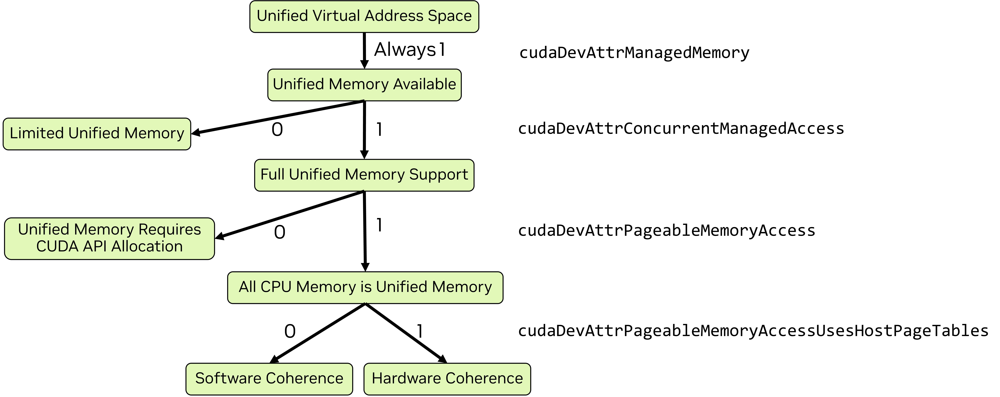

# 2.6 统一内存与系统内存

异构系统有多个可存放数据的物理内存。主机 CPU 有直连 DRAM，系统中每个 GPU 有自己的直连 DRAM。数据驻留在访问它的处理器内存中时性能最佳。CUDA 提供显式管理内存放置的 API，但代码会变得冗长并使软件设计复杂化。CUDA 提供旨在简化不同物理内存间数据分配、放置和迁移的特性与能力。

本章目的是介绍和解释这些特性及其对应用开发者在功能性和性能上的意义。统一内存有几种不同形态，取决于操作系统、驱动版本和所用 GPU。本章将展示如何确定适用哪种统一内存范式以及各范式下统一内存特性的行为。关于统一内存的后续章节会做更详细解释。

以下概念将在本章定义和解释：

- **统一虚拟地址空间（Unified Virtual Address Space）**——CPU 内存和每个 GPU 的内存在单一虚拟地址空间中有各自的范围
- **统一内存（Unified Memory）**——一种支持可在 CPU 与 GPU 间自动迁移的托管内存的 CUDA 特性
- **受限统一内存（Limited Unified Memory）**——带一些限制的统一内存范式
- **完整统一内存（Full Unified Memory）**——对统一内存特性的完整支持
- **带硬件一致性的完整统一内存（Full Unified Memory with Hardware Coherency）**——用硬件能力提供完整统一内存支持
- **统一内存提示（Unified memory hints）**——为特定分配指引统一内存行为的 API
- **页锁定主机内存（Page-locked Host Memory）**——非可换页的系统内存，某些 CUDA 操作需要
- **映射内存（Mapped memory）**——一种直接从 kernel 访问主机内存的机制（不同于统一内存）

此外，此处引入讨论统一内存和系统内存时用到的以下术语：

- **异构托管内存（Heterogeneous Managed Memory，HMM）**——Linux 内核的一个特性，为完整统一内存提供软件一致性
- **地址翻译服务（Address Translation Services，ATS）**——一种硬件特性，当 GPU 通过 NVLink Chip-to-Chip（C2C）互连连接到 CPU 时可用，为完整统一内存提供硬件一致性

## 2.6.1 统一虚拟地址空间

单一 OS 进程内，为所有主机内存和系统内所有 GPU 上的所有全局内存使用单一虚拟地址空间。主机和所有设备上的所有内存分配都位于此虚拟地址空间。无论用 CUDA API（如 `cudaMalloc`、`cudaMallocHost`）还是系统分配 API（如 `new`、`malloc`、`mmap`）做分配都是如此。CPU 和每个 GPU 在统一虚拟地址空间中有各自唯一范围。

这意味着：

- 任何内存的位置（即位于 CPU 还是哪个 GPU 内存）可用指针的值通过 `cudaPointerGetAttributes()` 确定
- `cudaMemcpy*()` 的 `cudaMemcpyKind` 参数可设为 `cudaMemcpyDefault` 来根据指针自动确定复制类型

## 2.6.2 统一内存

统一内存是一种 CUDA 内存特性，允许从 CPU 或 GPU 上运行的代码访问称为**托管内存（managed memory）**的内存分配。统一内存已在"CUDA C++ 入门"中展示。CUDA 支持的所有系统上都可用统一内存。

某些系统上，托管内存必须被显式分配。CUDA 中可用几种方式显式分配托管内存：

- CUDA API `cudaMallocManaged`
- CUDA API `cudaMallocFromPoolAsync`，用 `allocType` 设为 `cudaMemAllocationTypeManaged` 创建的池
- 带 `__managed__` 说明符的全局变量（见"内存空间说明符"）

在带 HMM 或 ATS 的系统上，所有系统内存隐式即为托管内存，无论用何种方式分配。无需特殊分配。

### 2.6.2.1 统一内存范式

统一内存的特性和行为因操作系统、Linux 内核版本、GPU 硬件以及 GPU-CPU 互连而异。可用 `cudaDeviceGetAttribute` 查询几个属性来确定可用统一内存形态：

- `cudaDevAttrConcurrentManagedAccess`——1 表示完整统一内存支持，0 表示受限支持
- `cudaDevAttrPageableMemoryAccess`——1 表示所有系统内存都受完整统一内存支持，0 表示仅显式分配为托管内存的才受完整支持
- `cudaDevAttrPageableMemoryAccessUsesHostPageTables`——指示 CPU/GPU 一致性机制：1 为硬件，0 为软件

图 21 图示了如何视觉确定统一内存范式，之后是同样逻辑的代码示例。

有四种统一内存运行范式：

- 对显式托管内存分配的完整支持
- 对全部分配带软件一致性的完整支持
- 对全部分配带硬件一致性的完整支持
- 受限统一内存支持

当完整支持可用时，它要么要求显式分配，要么所有系统内存隐式即为统一内存。当所有内存隐式统一时，一致性机制可以是软件或硬件。Windows 和某些 Tegra 设备对统一内存支持受限。



> 图 21 所有当前 GPU 都用统一虚拟地址空间并有统一内存可用。当 `cudaDevAttrConcurrentManagedAccess` 为 1 时可用完整统一内存支持，否则仅受限支持可用。当完整支持可用时，若 `cudaDevAttrPageableMemoryAccess` 也为 1，则所有系统内存都是统一内存。否则，仅用 CUDA API（如 `cudaMallocManaged`）分配的内存才是统一内存。当所有系统内存统一时，`cudaDevAttrPageableMemoryAccessUsesHostPageTables` 指示一致性由硬件（值为 1）还是软件（值为 0）提供。

表 3 以表格形式展示与图 21 相同的信息，并附本章相关章节和指南后续更完整文档的链接。

**表 3 统一内存范式概览**

| 统一内存范式 | 设备属性 | 完整文档 |
|---|---|---|
| 受限统一内存支持 | `cudaDevAttrConcurrentManagedAccess` 为 0 | Windows、WSL 与 Tegra 上的统一内存 / Tegra 内存管理 / Tegra 上的统一内存 |
| 对显式托管分配的完整支持 | `cudaDevAttrPageableMemoryAccess` 为 0 且 `cudaDevAttrConcurrentManagedAccess` 为 1 | 仅带 CUDA 托管内存支持的设备上的统一内存 |
| 对全部分配带软件一致性的完整支持 | `cudaDevAttrPageableMemoryAccessUsesHostPageTables` 为 0 且 `cudaDevAttrPageableMemoryAccess` 为 1 且 `cudaDevAttrConcurrentManagedAccess` 为 1 | 带完整 CUDA 统一内存支持的设备上的统一内存 |
| 对全部分配带硬件一致性的完整支持 | `cudaDevAttrPageableMemoryAccessUsesHostPageTables` 为 1 且 `cudaDevAttrPageableMemoryAccess` 为 1 且 `cudaDevAttrConcurrentManagedAccess` 为 1 | 带完整 CUDA 统一内存支持的设备上的统一内存 |

#### 2.6.2.1.1 统一内存范式：代码示例

下面代码示例对系统中每个 GPU 查询设备属性并按图 21 逻辑确定统一内存范式。

```cpp
void queryDevices()
{
    int numDevices = 0;
    cudaGetDeviceCount(&numDevices);
    for(int i=0; i<numDevices; i++)
    {
        cudaSetDevice(i);
        cudaInitDevice(0, 0, 0);
        int deviceId = i;

        int concurrentManagedAccess = -1;
        cudaDeviceGetAttribute (&concurrentManagedAccess, cudaDevAttrConcurrentManagedAccess, deviceId);
        int pageableMemoryAccess = -1;
        cudaDeviceGetAttribute (&pageableMemoryAccess, cudaDevAttrPageableMemoryAccess, deviceId);
        int pageableMemoryAccessUsesHostPageTables = -1;
        cudaDeviceGetAttribute (&pageableMemoryAccessUsesHostPageTables, cudaDevAttrPageableMemoryAccessUsesHostPageTables, deviceId);

        printf("Device %d has ", deviceId);
        if(concurrentManagedAccess){
            if(pageableMemoryAccess){
                printf("full unified memory support");
                if( pageableMemoryAccessUsesHostPageTables)
                    { printf(" with hardware coherency\n");  }
                else
                    { printf(" with software coherency\n"); }
            }
            else
                { printf("full unified memory support for CUDA-made managed allocations\n"); }
        }
        else
        {   printf("limited unified memory support: Windows, WSL, or Tegra\n");  }
    }
}
```

### 2.6.2.2 完整统一内存特性支持

大多数 Linux 系统有完整统一内存支持。若设备属性 `cudaDevAttrPageableMemoryAccess` 为 1，则所有系统内存——无论由 CUDA API 还是系统 API 分配——都以带完整特性支持的统一内存运作。这包括用 `mmap` 创建的文件支持内存分配。

若 `cudaDevAttrPageableMemoryAccess` 为 0，则仅由 CUDA 分配为托管内存的内存行为如统一内存。系统 API 分配的内存不被托管，不一定能从 GPU kernel 访问。

一般而言，对带完整支持的统一分配：

- 托管内存通常分配在它首次触及的处理器内存空间
- 托管内存通常在它被当前驻留处理器以外的处理器使用时迁移
- 托管内存以内存页（软件一致性）或缓存行（硬件一致性）粒度迁移或访问
- 允许超额订阅：应用可分配超过 GPU 物理可用的托管内存
- 分配和迁移行为可能偏离上述。可由程序员用提示和预取影响。完整覆盖见"带完整 CUDA 统一内存支持的设备上的统一内存"。

#### 2.6.2.2.1 带硬件一致性的完整统一内存

在 Grace Hopper 和 Grace Blackwell 等硬件上——使用 NVIDIA CPU 且 CPU 与 GPU 间互连为 NVLink Chip-to-Chip（C2C）——可用地址翻译服务（ATS）。ATS 可用时 `cudaDevAttrPageableMemoryAccessUsesHostPageTables` 为 1。

带 ATS，除对全部主机分配的完整统一内存支持外：

- 驻留 GPU 的托管分配（如 `cudaMallocManaged`）可从 CPU 访问而无需迁移（`cudaDevAttrDirectManagedMemAccessFromHost` 将为 1）
- CPU 与 GPU 间链路支持原生原子（`cudaDevAttrHostNativeAtomicSupported` 将为 1）
- 硬件一致性支持相比软件一致性可改善性能

ATS 提供 HMM 的全部能力。ATS 可用时 HMM 自动禁用。硬件 vs. 软件一致性的进一步讨论见"CPU 与 GPU 页表：硬件一致性 vs. 软件一致性"。

> **注意**
>
> 硬件一致性不启用从主机访问 GPU 专属分配——如用 `cudaMalloc` 创建的分配。

#### 2.6.2.2.2 HMM——带软件一致性的完整统一内存

异构内存管理（Heterogeneous Memory Management，HMM）是 Linux 操作系统（带合适内核版本）上可用的特性，启用带软件一致性的完整统一内存支持。异构内存管理把 ATS 提供的部分能力和便利带到 PCIe 连接的 GPU。

在带至少 Linux 内核 6.1.24、6.2.11 或 6.3 及以上的 Linux 上，异构内存管理（HMM）可能可用。下面命令可用来查找寻址模式是否为 HMM。

```bash
$ nvidia-smi -q | grep Addressing
Addressing Mode : HMM
```

HMM 可用时，完整统一内存受支持且所有系统分配隐式为统一内存。若系统同时有 ATS，HMM 被禁用并使用 ATS——因为 ATS 提供 HMM 全部能力及更多。

### 2.6.2.3 受限统一内存支持

在 Windows（含 Windows Subsystem for Linux，WSL）和某些 Tegra 系统上，仅可用统一内存功能的受限子集。这些系统上托管内存可用，但 CPU 与 GPU 间的迁移行为不同。

- 托管内存首次分配在 CPU 物理内存中
- 托管内存以比虚拟内存页更大的粒度迁移
- 托管内存在 GPU 开始执行时迁移到 GPU
- GPU 活跃时 CPU 不得访问托管内存
- 托管内存在 GPU 同步时迁移回 CPU
- 不允许 GPU 内存超额订阅
- 仅由 CUDA 显式分配为托管内存的内存才是统一的

此范式的完整覆盖见"Windows、WSL 与 Tegra 上的统一内存"。

### 2.6.2.4 内存建议与预取

程序员可向管理统一内存的 NVIDIA 驱动提供提示以帮助最大化应用性能。CUDA API `cudaMemAdvise` 允许程序员指定影响分配放置位置以及从其它设备访问时是否迁移的属性。

`cudaMemPrefetchAsync` 允许程序员建议开始把特定分配异步迁移到不同位置。一种常见用法是在 kernel 发射前先开始 kernel 将要使用的数据传输。这使数据复制可在其它 GPU kernel 执行时发生。

"性能提示"小节覆盖可传给 `cudaMemAdvise` 的不同提示，并展示使用 `cudaMemPrefetchAsync` 的示例。

## 2.6.3 页锁定主机内存

入门代码示例中，`cudaMallocHost` 用于在 CPU 上分配内存。它在主机上分配**页锁定内存**（也称**固定内存**）。通过 `malloc`、`new` 或 `mmap` 等传统分配机制在主机上做的分配不是页锁定的，意味着它们可能被换页到磁盘或被操作系统重定位。

CPU 与 GPU 间的异步复制要求页锁定主机内存。页锁定主机内存也改善同步复制性能。页锁定内存可被映射到 GPU 以便从 GPU kernel 直接访问。

CUDA 运行时提供分配页锁定主机内存或页锁定既有分配的 API：

- `cudaMallocHost` 分配页锁定主机内存
- `cudaHostAlloc` 默认行为与 `cudaMallocHost` 相同，但还取标志指定其它内存参数
- `cudaFreeHost` 释放由 `cudaMallocHost` 或 `cudaHostAlloc` 分配的内存
- `cudaHostRegister` 页锁定一段在 CUDA API 外分配的既有内存，如用 `malloc` 或 `mmap`
- `cudaHostRegister` 使第三方库或开发者不可控的其它代码分配的主机内存可被页锁定，以便用于异步复制或映射

> **注意**
>
> 页锁定主机内存可被系统中所有 GPU 用于异步复制和映射内存。
>
> 页锁定主机内存在非 I/O 一致性 Tegra 设备上不被缓存。此外，`cudaHostRegister()` 在非 I/O 一致性 Tegra 设备上不支持。

### 2.6.3.1 映射内存

在带 HMM 或 ATS 的系统上，所有主机内存可直接用主机指针从 GPU 访问。当 ATS 或 HMM 不可用时，可通过把内存映射进 GPU 内存空间使主机分配可被 GPU 访问。映射内存总是页锁定的。

下面代码示例图示在映射主机内存上直接操作的数组复制 kernel。

```cpp
__global__ void copyKernel(float* a, float* b)
{
        int idx = threadIdx.x + blockDim.x * blockIdx.x;
        a[idx] = b[idx];
}
```

虽然映射内存可能在某些未复制到 GPU 的特定数据需从 kernel 访问的场合有用，但在 kernel 中访问映射内存需要跨越 CPU-GPU 互连（PCIe 或 NVLink C2C）的事务。这些操作相比访问设备内存延迟更高、带宽更低。对 kernel 大部分内存需求，映射内存不应被视为统一内存或显式内存管理的高性能替代。

#### 2.6.3.1.1 cudaMallocHost 与 cudaHostAlloc

用 `cudaMallocHost` 或 `cudaHostAlloc` 分配的主机内存自动被映射。这些 API 返回的指针可直接在 kernel 代码中用于访问主机内存。主机内存通过 CPU-GPU 互连访问。

**cudaMallocHost**

```cpp
void usingMallocHost() {
  float* a = nullptr;
  float* b = nullptr;

  CUDA_CHECK(cudaMallocHost(&a, vLen*sizeof(float)));
  CUDA_CHECK(cudaMallocHost(&b, vLen*sizeof(float)));

  initVector(b, vLen);
  memset(a, 0, vLen*sizeof(float));

  int threads = 256;
  int blocks = vLen/threads;
  copyKernel<<<blocks, threads>>>(a, b);
  CUDA_CHECK(cudaGetLastError());
  CUDA_CHECK(cudaDeviceSynchronize());

  printf("Using cudaMallocHost: ");
  checkAnswer(a,b);
}
```

**cudaHostAlloc**

（`cudaHostAlloc` 用法类似，可用标志指定其它内存参数。）

#### 2.6.3.1.2 cudaHostRegister

当 ATS 和 HMM 不可用时，系统分配器做的分配仍可用 `cudaHostRegister` 映射以从 GPU kernel 直接访问。但与用 CUDA API 创建的内存不同，该内存不能从 kernel 用主机指针访问。必须用 `cudaHostGetDevicePointer()` 获取设备内存区的指针，且该指针必须用于 kernel 代码中的访问。

```cpp
void usingRegister() {
  float* a = nullptr;
  float* b = nullptr;
  float* devA = nullptr;
  float* devB = nullptr;

  a = (float*)malloc(vLen*sizeof(float));
  b = (float*)malloc(vLen*sizeof(float));
  CUDA_CHECK(cudaHostRegister(a, vLen*sizeof(float), 0 ));
  CUDA_CHECK(cudaHostRegister(b, vLen*sizeof(float), 0  ));

  CUDA_CHECK(cudaHostGetDevicePointer((void**)&devA, (void*)a, 0));
  CUDA_CHECK(cudaHostGetDevicePointer((void**)&devB, (void*)b, 0));

  initVector(b, vLen);
  memset(a, 0, vLen*sizeof(float));

  int threads = 256;
  int blocks = vLen/threads;
  copyKernel<<<blocks, threads>>>(devA, devB);
  CUDA_CHECK(cudaGetLastError());
  CUDA_CHECK(cudaDeviceSynchronize());

  printf("Using cudaHostRegister: ");
  checkAnswer(a, b);
}
```

#### 2.6.3.1.3 统一内存与映射内存比较

映射内存让 CPU 内存可从 GPU 访问，但不保证所有访问类型（如原子）在所有系统上受支持。统一内存保证所有访问类型受支持。

映射内存留在 CPU 内存中，意味着所有 GPU 访问必须经 CPU 与 GPU 间连接：PCIe 或 NVLink。跨这些链路访问的延迟显著高于 GPU 内存访问，可用总带宽更低。因此，对所有 kernel 内存访问都用映射内存不太可能充分利用 GPU 计算资源。

统一内存最常被迁移到访问它的处理器物理内存。首次迁移后，kernel 对同一内存页或缓存行的重复访问可利用全部 GPU 内存带宽。

> **注意**
>
> 映射内存先前文档中也称为**零拷贝内存（zero-copy memory）**。
>
> 在所有 CUDA 应用使用统一虚拟地址空间之前，需要额外 API 启用内存映射（带 `cudaDeviceMapHost` 的 `cudaSetDeviceFlags`）。这些 API 不再需要。
>
> 对映射主机内存操作的原子函数（见"原子函数"）从主机或其它 GPU 视角不是原子的。
>
> CUDA 运行时要求从设备发起的对主机内存的 1 字节、2 字节、4 字节、8 字节和 16 字节自然对齐的 load 和 store，从主机和其它设备视角被保留为单次访问。在某些平台上，对内存的原子操作可能被硬件拆为单独的 load 和 store 操作。这些组成 load 和 store 操作对自然对齐访问的保留有相同要求。CUDA 运行时不支持 PCI Express 桥拆分 8 字节自然对齐操作的 PCI Express 总线拓扑，NVIDIA 也不知道有任何拓扑会拆分 16 字节自然对齐操作。

## 2.6.4 总结

- 在带异构内存管理（HMM）或地址翻译服务（ATS）的 Linux 平台上，所有系统分配的内存都是托管内存
- 在不带 HMM 或 ATS 的 Linux 平台、Tegra 处理器以及所有 Windows 平台上，托管内存必须用 CUDA 分配：
  - `cudaMallocManaged` 或
  - `cudaMallocFromPoolAsync`，用 `allocType=cudaMemAllocationTypeManaged` 创建的池
  - 带 `__managed__` 说明符的全局变量
- 在 Windows 和 Tegra 处理器上，统一内存有限制
- 在带 NVLINK C2C 连接和 ATS 的系统上，用 `cudaMallocManaged` 分配的设备内存可从 CPU 或其它 GPU 直接访问

---

[← 上一章 2.5 异步执行](08_asynchronous_execution.md) ｜ [返回附录 C 首页](README.md)