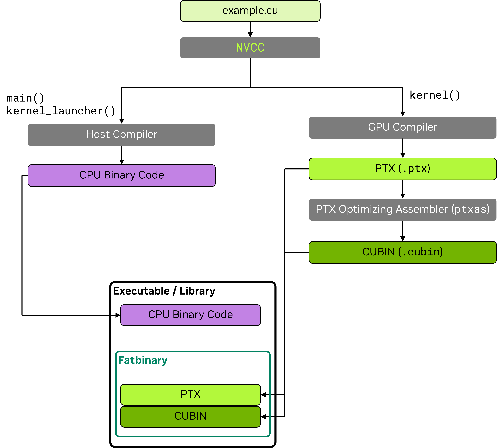

# 2.7 NVCC：NVIDIA CUDA 编译器

NVIDIA CUDA 编译器 nvcc 是 NVIDIA 用于编译 CUDA C/C++ 以及 PTX 代码的工具链。该工具链是 CUDA Toolkit 的一部分，由若干工具组成，包括编译器、链接器以及 PTX 和 cubin 汇编器。顶层 nvcc 工具协调编译流程，为每个编译阶段调用合适工具。

nvcc 驱动 CUDA 代码的**离线编译**，与之相对的是由 CUDA 运行时编译器 nvrtc 驱动的在线或即时（JIT）编译。

本章覆盖构建应用所需的 nvcc 最常见用法和细节。nvcc 的完整覆盖见 nvcc 文档。

## 2.7.1 CUDA 源文件与头文件

用 nvcc 编译的源文件可含在 CPU 上执行的主机代码和在 GPU 上执行的设备代码的组合。nvcc 接受常见 C/C++ 源文件扩展名 `.c`、`.cpp`、`.cc`、`.cxx` 用于仅主机代码，用 `.cu` 用于含设备代码或混有主机和设备代码的文件。含设备代码的头文件通常采用 `.cuh` 扩展名，以区别于仅主机代码头文件 `.h`、`.hpp`、`.hh`、`.hxx` 等。

| 文件扩展名 | 描述 | 内容 |
|---|---|---|
| `.c` | C 源文件 | 仅主机代码 |
| `.cpp`、`.cc`、`.cxx` | C++ 源文件 | 仅主机代码 |
| `.h`、`.hpp`、`.hh`、`.hxx` | C/C++ 头文件 | 设备代码、主机代码、主机/设备混合代码 |
| `.cu` | CUDA 源文件 | 设备代码、主机代码、主机/设备混合代码 |
| `.cuh` | CUDA 头文件 | 设备代码、主机代码、主机/设备混合代码 |

## 2.7.2 NVCC 编译流程

在初始阶段，nvcc 把设备代码与主机代码分离，并把它们的编译分别派发给 GPU 和主机编译器。

为编译主机代码，CUDA 编译器 nvcc 要求有可用且兼容的主机编译器。CUDA Toolkit 定义了 Linux 和 Windows 平台的主机编译器支持策略。

仅含主机代码的文件可用 nvcc 或主机编译器直接构建。产生的目标文件可在链接时与含 GPU 代码的 nvcc 目标文件合并。

GPU 编译器把 C/C++ 设备代码编译为 PTX 汇编代码。GPU 编译器对编译命令行中指定的每个虚拟机指令集架构（如 `compute_90`）各运行一次。

各 PTX 代码随后传给 `ptxas` 工具，为目标硬件 ISA 生成 cubin。硬件 ISA 由其 SM 版本标识。

可把多个 PTX 和 cubin 目标嵌入到应用或库中的单一二进制 fatbin 容器中，使单个二进制可支持多个虚拟和目标硬件 ISA。

上述工具的调用和协调由 nvcc 自动完成。`-v` 选项可用于显示完整编译流程和工具调用。`-keep` 选项可用于把编译期间生成的中间文件保存在当前目录或 `--keep-dir` 指定目录中。

下面示例图示 CUDA 源文件 `example.cu` 的编译流程：

```cpp
// ----- example.cu -----
#include <stdio.h>
__global__ void kernel() {
    printf("Hello from kernel\n");
}

void kernel_launcher() {
    kernel<<<1, 1>>>();
    cudaDeviceSynchronize();
}

int main() {
    kernel_launcher();
    return 0;
}
```

nvcc 基本编译流程：



> nvcc 基本编译流程。

带多个 PTX 和 cubin 架构的 nvcc 编译流程：


> 带多个 PTX 和 cubin 架构的 nvcc 编译流程。

nvcc 编译流程的更详细描述见编译器文档。

## 2.7.3 NVCC 基本用法

用 nvcc 编译 CUDA 源文件的基本命令是：

```bash
nvcc <source_file>.cu -o <output_file>
```

nvcc 接受常用编译标志——指定包含目录 `-I <path>` 和库路径 `-L <path>`、链接到其它库 `-l<library>`、定义宏 `-D<macro>=<value>`。

```bash
nvcc example.cu -I path_to_include/ -L path_to_library/ -lcublas -o <output_file>
```

### 2.7.3.1 NVCC PTX 与 Cubin 生成

默认情况下，nvcc 为 CUDA Toolkit 支持的最早 GPU 架构（最低的 `compute_XY` 和 `sm_XY` 版本）生成 PTX 和 cubin，以最大化兼容性。

`-arch` 选项可用于为特定 GPU 架构生成 PTX 和 cubin。

`-gencode` 选项可用于为多个 GPU 架构生成 PTX 和 cubin。

完整支持的虚拟和真实 GPU 架构列表可通过 `--list-gpu-code` 和 `--list-gpu-arch` 标志获得，或参见 nvcc 文档中的"虚拟架构列表"和"GPU 架构列表"小节。

```bash
nvcc --list-gpu-code # list all supported real GPU architectures
nvcc --list-gpu-arch # list all supported virtual GPU architectures
nvcc example.cu -arch=compute_<XY> # e.g. -arch=compute_80 for NVIDIA Ampere GPUs and later
                                   # PTX-only, GPU forward compatible

nvcc example.cu -arch=sm_<XY>      # e.g. -arch=sm_80 for NVIDIA Ampere GPUs and later
                                   # PTX and Cubin, GPU forward compatible

nvcc example.cu -arch=native       # automatically detects and generates Cubin for the current GPU
                                   # no PTX, no GPU forward compatibility

nvcc example.cu -arch=all          # generate Cubin for all supported GPU architectures
                                   # also includes the latest PTX for GPU forward compatibility

nvcc example.cu -arch=all-major    # generate Cubin for all major supported GPU architectures, e.g. sm_80, sm_90,
                                   # also includes the latest PTX for GPU forward compatibility
```

更进阶的用法允许 PTX 和 cubin 目标分别指定：

```bash
# generate PTX for virtual architecture compute_80 and compile it to Cubin for real architecture sm_86, keep compute_80 PTX
nvcc example.cu -arch=compute_80 -gpu-code=sm_86,compute_80 # (PTX and Cubin)

# generate PTX for virtual architecture compute_80 and compile it to Cubin for real architecture sm_86, sm_89
nvcc example.cu -arch=compute_80 -gpu-code=sm_86,sm_89    # (no PTX)
nvcc example.cu -gencode=arch=compute_80,code=sm_86,sm_89 # same as above

# (1) generate PTX for virtual architecture compute_80 and compile it to Cubin for real architecture sm_86, sm_89
# (2) generate PTX for virtual architecture compute_90 and compile it to Cubin for real architecture sm_90
nvcc example.cu -gencode=arch=compute_80,code=sm_86,sm_89 -gencode=arch=compute_90,code=sm_90
```

引导 GPU 代码生成的 nvcc 命令行选项完整参考见 nvcc 文档。

### 2.7.3.2 主机代码编译说明

不含设备代码或符号的编译单元——即源文件及其头文件——可用主机编译器直接编译。若任一编译单元使用 CUDA 运行时 API 函数，应用必须与 CUDA 运行时库链接。CUDA 运行时既有静态库 `libcudart_static` 也有动态库 `libcudart`。默认情况下 nvcc 链接静态 CUDA 运行时库。要用动态库版本的 CUDA 运行时，在编译或链接命令上向 nvcc 传 `--cudart=shared` 标志。

nvcc 允许通过 `-ccbin <compiler>` 参数指定用于主机函数的主机编译器。也可定义环境变量 `NVCC_CCBIN` 指定 nvcc 用主机编译器。nvcc 的 `-Xcompiler` 参数把参数透传给主机编译器。例如下面示例中 `-O3` 参数由 nvcc 传给主机编译器。

```bash
nvcc example.cu -ccbin=clang++

export NVCC_CCBIN='gcc'
nvcc example.cu -Xcompiler=-O3
```

### 2.7.3.3 GPU 代码的分离编译

nvcc 默认为整程序编译，期望所有 GPU 代码和符号都出现在使用它们的编译单元中。CUDA device 函数可调用定义在其它编译单元的 device 函数或访问 device 变量，但必须在 nvcc 命令行上指定 `-rdc=true` 或其别名 `-dc` 标志以启用从不同编译单元链接设备代码。链接不同编译单元的设备代码和符号的能力称为**分离编译**。

分离编译允许更灵活的代码组织，可改善编译时间，并可使二进制更小。相比整程序编译，分离编译可能带来一些构建期复杂度。使用设备代码链接可能影响性能，因此默认不启用。链接时优化（LTO）可帮助减少分离编译的性能开销。

分离编译要求以下条件：

- 在一个编译单元中定义的非 const device 变量必须在其它编译单元中用 `extern` 关键字引用。
- 所有 const device 变量必须用 `extern` 关键字定义和引用。
- 所有 CUDA 源文件 `.cu` 必须用 `-dc` 或 `-rdc=true` 标志编译。
- 主机和设备函数默认有外部链接，不需要 `extern` 关键字。注意从 CUDA 13 起，`__global__` 函数和 `__managed__`/`__device__`/`__constant__` 变量默认有内部链接。

下面示例中，`definition.cu` 定义一个变量和一个函数，`example.cu` 引用它们。两个文件分别编译并链接到最终二进制。

```cpp
// ----- definition.cu -----
extern __device__ int device_variable = 5;
__device__        int device_function() { return 10; }
// ----- example.cu -----
extern __device__ int  device_variable;
__device__        int device_function();

__global__ void kernel(int* ptr) {
    device_variable = 0;
    *ptr            = device_function();
}
```

```bash
nvcc -dc definition.cu -o definition.o
nvcc -dc example.cu    -o example.o
nvcc definition.o example.o -o program
```

## 2.7.4 常用编译选项

本节介绍与 nvcc 配用的最相关编译选项，覆盖语言特性、优化、调试、性能分析和构建等方面。所有选项的完整描述见 nvcc 文档。

### 2.7.4.1 语言特性

nvcc 支持 C++ 核心语言特性，从 C++03 到 C++23 语言特性。`-std` 标志可用于指定要使用的语言标准：

```bash
--std={c++03|c++11|c++14|c++17|c++20|c++23}
```

此外 nvcc 支持以下语言扩展：

- `-restrict`：声明所有 kernel 指针参数为 restrict 指针。
- `-extended-lambda`：允许在 lambda 声明中用 `__host__`、`__device__` 标注。
- `-expt-relaxed-constexpr`：（实验标志）允许主机代码调用 `__device__` constexpr 函数，设备代码调用 `__host__` constexpr 函数。

这些特性的更多细节见 extended lambda 和 constexpr 章节。

### 2.7.4.2 调试选项

nvcc 支持以下选项生成调试信息：

- `-g`：为主机代码生成调试信息。gdb/lldb 等工具依赖此信息调试主机代码。
- `-G`：为设备代码生成调试信息。cuda-gdb 依赖此信息调试设备代码。此标志还定义 `__CUDACC_DEBUG__` 宏。
- `-lineinfo`：为设备代码生成行号信息。此选项不影响执行性能，与 `compute-sanitizer` 工具配合追查 kernel 执行有用。

nvcc 默认用最高优化级别 `-O3` 编译 GPU 代码。调试标志 `-G` 阻止某些编译器优化，因此调试代码性能预期比非调试代码低。可定义 `-DNDEBUG` 标志禁用运行时断言——断言也可能拖慢执行。

### 2.7.4.3 优化选项

nvcc 提供众多优化性能的选项。本节旨在简要考察开发者可能有用的部分选项并提供进一步信息链接。完整覆盖见 nvcc 文档。

- `-Xptxas`：把参数传给 PTX 汇编工具 `ptxas`。nvcc 文档提供 `ptxas` 的可用参数列表。例如 `-Xptxas=-maxrregcount=N` 指定每线程最大寄存器数。
- `-extra-device-vectorization`：启用更激进的设备代码向量化。
- `--apply-controls=/path/to/file`：把高级控制文件（ACF）传给 nvcc 和 ptxas。此文件改变默认编译行为，使其更针对特定工作负载。使用高级控制文件可能导致编译失败或运行时错误执行。自担风险使用。生成高级控制文件的更多信息见 CompileIQ Github 页面。

提供对浮点行为细粒度控制的额外标志在"浮点计算"章节和 nvcc 文档中覆盖。

以下标志从编译器获取输出，对更进阶代码优化有用：

- `-res-usage`：编译后打印资源使用报告。含为每个 kernel 函数分配的寄存器数、共享内存、常量内存和 local 内存。
- `-opt-info=inline`：打印关于内联函数的信息。
- `-Xptxas=-warn-lmem-usage`：若用 local 内存则警告。
- `-Xptxas=-warn-spills`：若寄存器溢出到 local 内存则警告。

### 2.7.4.4 链接时优化（LTO）

由于跨文件优化机会有限，分离编译可能导致比整程序编译更低的性能。**链接时优化（LTO）** 通过在链接时对分离编译的文件间执行优化来应对，代价是编译时间增加。LTO 可恢复整程序编译的大部分性能，同时保持分离编译的灵活性。

nvcc 要求 `-dlto` 标志或 `lto_<SM version>` 链接时优化目标以启用 LTO：

```bash
nvcc -dc -dlto -arch=sm_100 definition.cu -o definition.o
nvcc -dc -dlto -arch=sm_100 example.cu    -o example.o
nvcc -dlto definition.o example.o -o program
```

```bash
nvcc -dc -arch=lto_100 definition.cu -o definition.o
nvcc -dc -arch=lto_100 example.cu    -o example.o
nvcc -dlto definition.o example.o -o program
```

### 2.7.4.5 性能分析选项

可直接用 Nsight Compute 和 Nsight Systems 工具剖析 CUDA 应用，无需在编译过程中加额外标志。但 nvcc 可生成的额外信息能通过把源文件与生成代码关联来辅助剖析：

- `-lineinfo`：为设备代码生成行号信息；这允许在剖析工具中查看源代码。剖析工具要求原始源代码在编译时位置可用。
- `-src-in-ptx`：把原始源代码保留在 PTX 中，避免上述 `-lineinfo` 的限制。要求 `-lineinfo`。

### 2.7.4.6 Fatbin 压缩

nvcc 默认压缩存储在应用或库二进制中的 fatbin。fatbin 压缩可用以下选项控制：

- `-no-compress`：禁用 fatbin 压缩。
- `--compress-mode={default|size|speed|balance|none}`：设置压缩模式。`speed` 专注快速解压时间，`size` 旨在减小 fatbin 大小。`balance` 在速度和大小间提供权衡。默认模式为 `speed`。`none` 禁用压缩。

### 2.7.4.7 编译器性能控制

nvcc 提供分析和加速编译过程本身的选项：

- `-t <N>`：用于为多个 GPU 架构并行编译单个编译单元的 CPU 线程数。
- `-split-compile <N>`：用于并行化优化阶段的 CPU 线程数。
- `-split-compile-extended <N>`：更激进形式的拆分编译。要求链接时优化。
- `-Ofc <N>`：设备代码编译速度级别。
- `-time <filename>`：生成含各编译阶段耗时的逗号分隔值（CSV）表。
- `-fdevice-time-trace`：为设备代码编译生成时间跟踪。

---

[← 上一章 2.6 统一内存与系统内存](09_unified_system_memory.md) ｜ [返回附录 C 首页](README.md)